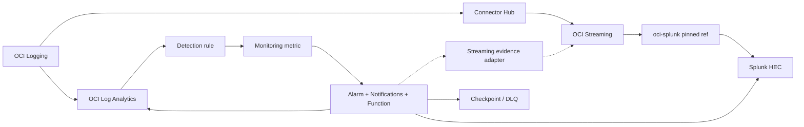
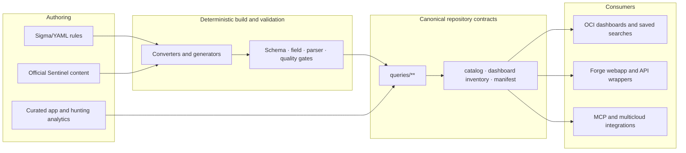
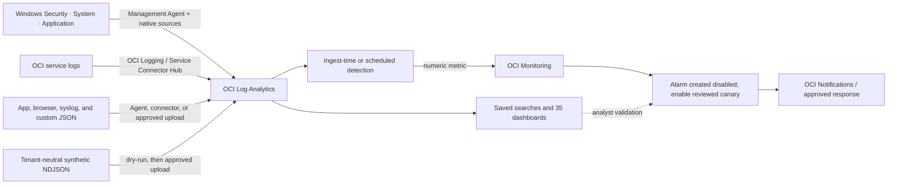

# OCI Log Analytics Detection Rules

A comprehensive STIG-compliant detection rules library for Oracle Cloud Infrastructure (OCI) Log Analytics. Converts industry-standard [Sigma](https://github.com/SigmaHQ/sigma) rules into OCI Log Analytics Query Language (OCL) with MITRE ATT&CK and STIG compliance mapping. Enhanced with advanced threat hunting queries, APT-specific detection (BLUELIGHT/APT37), and browser/application attack detection via `SOC Application Logs`, an OpenTelemetry-shaped custom JSON telemetry surface for OCI Log Analytics.

## Core Scope

This repository is scoped to OCI Log Analytics query, dashboard, and Forge webapp delivery:

- generate OCI Log Analytics query JSON from source Sigma/YAML rules
- maintain curated app, WAF, geographic health, and hunting analytics
- generate synthetic logs that populate the dashboards
- validate query metadata, log-source mappings, and dashboard inventory
- create OCI Log Analytics dashboards and embedded saved searches only after validation passes
- provide manual and script-assisted Windows Event Log onboarding, including guarded Management Agent installation, native source association, saved searches, scheduled detections, disabled alarm canaries, and operator evidence gates
- provide an OKE monitoring fast path using Oracle's Kubernetes Monitoring Quick Start for logs, metrics, object discovery, dashboards, and Log Analytics detection integration
- ship the integrated Forge webapp for cross-QL conversion into OCI Log Analytics QL
- publish redacted OCI Logging and Log Analytics detection-event examples for third-party SIEM parser development

The integrated UI lives in `webapp/` and consumes generated artifacts from this repository instead of duplicating query generation or dashboard deployment logic. External API, MCP, and cross-platform integrations follow the same generated-artifact contract. Runtime helpers such as Streaming, Service Connector Hub, Resource Manager, and manifest export support the demo and deployment path, but the canonical product surface remains `rules/**`, `queries/**`, `test_data/manifest.json`, `scripts/deploy_dashboard.py`, and `webapp/`.

## Project Scope and Deployment Boundary

This project is a detection-content and OCI Log Analytics delivery repository. It authors and converts detection queries, validates their field and source contracts, produces parser-safe examples, and packages dashboard/saved-search deployment content. It is not a hosted SIEM and it never stores a customer's OCI credentials, tenancy values, raw production logs, or management-plane access in Forge.

For a customer deployment, Forge prepares the committed Resource Manager package and opens OCI Resource Manager. The customer selects the target compartment, reviews the Terraform plan, and applies it with their own OCI session and IAM permissions. This boundary keeps tenancy selection, approval, and privileged writes inside the OCI Console. See [DEPLOYMENT.md](docs/DEPLOYMENT.md) and [stack/README.md](stack/README.md) for the supported workflow and prerequisites.

## Start Here: OCI Security Migration

This is a migration accelerator for teams moving security analytics into OCI Log Analytics or using it as a high-fidelity analysis layer before a third-party SIEM. It is designed to help customers establish parser-ready telemetry, deploy a governed detection baseline, and extend coverage without coupling the repository to a specific tenancy.

1. Read the [migration and security guide](docs/MIGRATION_AND_SECURITY_GUIDE.md) to select log sources, a rollout wave, and initial use cases.
2. Use the [SIEM log samples](queries/siem_log_examples.json) or Forge **Log Samples** to develop downstream parsers from redacted OCI Logging envelopes and normalized detection events.
3. Use Forge **Deploy to OCI** to obtain the Resource Manager package; review and apply it from the customer's OCI tenancy.
4. Validate sources and parser fields, then enable dashboards and detections in small, observable waves.
5. Use Log Analytics to normalize, enrich, correlate, and suppress noise before forwarding the selected security signal to a cost-sensitive SIEM.

The [documentation hub](docs/README.md) is the maintained wiki-style entry point for operators, SOC teams, contributors, and integration owners.
The public [OCI SD Observability documentation hub](https://github.com/adibirzu/oci-sd-observability) starts from customer needs and answers, then links back to the technical assets in this repository. It includes service definitions for fast onboarding, Windows access monitoring, OKE observability, Parallel SIEM, Oracle Database security analytics, and cost-aware retention.
For hands-on use, start with [Using OCI Log Analytics Queries](docs/LOG_ANALYTICS_QUERY_USAGE.md) to select an artifact, run it in Log Explorer, customize OCL safely, and validate it locally or against an approved OCI target.
For a new customer deployment, follow the [OCI Log Analytics Fast Onboarding Track](docs/FAST_ONBOARDING_TRACK.md) to establish IAM, choose an ingestion path, prove the first two sources, and plan a governed production rollout.
For Kubernetes clusters, use the [OKE Monitoring One Pager](docs/OKE_MONITORING_ONE_PAGER.md) to select the guided, Helm, or Resource Manager path, review IAM, and prove logs, metrics, object discovery, and dashboards. Continue with the detailed [OKE Observability Runbook](docs/OKE_OBSERVABILITY_RUNBOOK.md).
For storage design, use [Cost Optimization and Archive Retention](docs/LOG_ANALYTICS_COST_OPTIMIZATION.md) to decide active versus archive retention, recall/release workflow, and when Splunk parallel delivery justifies duplicate cost.
For the Windows access use case, continue with [Windows Access Monitoring Fast Onboarding](docs/WINDOWS_ACCESS_FAST_ONBOARDING.md), then choose the [manual console runbook](docs/WINDOWS_ACCESS_MANUAL_RUNBOOK.md) or [script-assisted runbook](docs/WINDOWS_ACCESS_SCRIPTED_RUNBOOK.md). The [workflow diagrams](docs/WINDOWS_ACCESS_WORKFLOW_DIAGRAMS.md) show collection, detection, notification, troubleshooting, and evidence gates.

## Splunk Parallel Operations

Splunk can run beside Log Analytics in two independently approved modes. **Mode 1** sends selected raw OCI Logging sources through a separate Connector Hub connector, OCI Streaming, and a pinned `adibirzu/oci-splunk` release to Splunk HEC. **Mode 2** keeps Log Analytics as the source of truth and exports bounded, normalized evidence only after a detection rule posts a Monitoring metric and an alarm invokes the exporter through Notifications. The Mode 2 Function can deliver directly to Splunk HEC or publish the same versioned evidence to an approved OCI Stream consumed by the pinned `adibirzu/oci-splunk` deployment. A hybrid policy may choose either or both paths per source/detection.



The dashed detection-to-Streaming route is implemented by the exporter Function when `SPLUNK_EVIDENCE_TARGET=streaming`; Log Analytics does not automatically publish detection rows to Streaming. This path needs the exact Stream OCID/messages endpoint, scoped `stream-push` policy, and a pinned `oci-splunk` consumer configured for the normalized JSON contract. Start with [Splunk Parallel Operations](docs/SPLUNK_PARALLEL_OPERATIONS.md), then use the [rule migration guide](docs/SPLUNK_RULE_MIGRATION.md), [evidence export runbook](docs/SPLUNK_EVIDENCE_EXPORT_RUNBOOK.md), and [E2E validation guide](docs/SPLUNK_E2E_VALIDATION.md). Editable sources include the full [Splunk architecture](docs/diagrams/logan-splunk-architecture.mmd), [raw fan-out](docs/diagrams/logan-splunk-raw-fanout.mmd), and [project content architecture](docs/diagrams/project-content-architecture.mmd). Local tests and plans do not prove OCI/Streaming/HEC deployment or Splunk searchability.
Use [Cost Optimization and Archive Retention](docs/LOG_ANALYTICS_COST_OPTIMIZATION.md) when deciding whether a source belongs in Mode 1 raw fan-out, Mode 2 governed evidence export, or an archive-first Log Analytics retention policy.

Implementation entry points:

- [implementation plan and status](docs/SPLUNK_PARALLEL_IMPLEMENTATION_PLAN.md)
- [delivery policy](config/splunk_parallel_delivery.yaml) and [generated nine-rule registry](queries/splunk_detection_registry.json)
- [registry generator](scripts/generate_splunk_detection_registry.py) and [operator/E2E CLI](scripts/splunk_evidence_exporter_cli.py)
- [optional Terraform/Resource Manager module](stack/modules/splunk_evidence_exporter) and [Function source](stack/modules/splunk_evidence_exporter/function)
- [local evidence receipt](docs/health/splunk-parallel-local-evidence.example.json) and [complete workflow diagram set](docs/diagrams)

```bash
python3 scripts/generate_splunk_detection_registry.py --check
python3 scripts/splunk_evidence_exporter_cli.py validate-config
python3 scripts/splunk_evidence_exporter_cli.py local-e2e --scenario success
python3 scripts/splunk_evidence_exporter_cli.py local-e2e --scenario success --delivery-target streaming
python3 scripts/release_checklist.py --splunk-parallel-offline-stage
```

## Current Inventory
This repository ships both source authoring content and generated OCI query assets. Published counts should come from the generated catalog, not from hand-maintained release notes.

- **Source Sigma/YAML rules:** 522
- **Sigma-derived OCI query artifacts:** 553
  - 545 top-level detections in `queries/*.json`
  - 8 browser/app telemetry detections in `queries/apps/*.json`
- **Microsoft Sentinel converted queries:** 590 live OCI parser-passing queries
- **Curated analytics:** 209
  - 54 app telemetry analytics in `queries/apps/`
  - 155 hunting analytics in `queries/hunting/`
- **Total query artifacts/content items:** 1,352
- **Source rule breakdown:** Windows (302), Cloud/OCI (102), Linux (80), Web/WAF (38)
- **Combined MITRE ATT&CK coverage:** 279 techniques across 14 tactics
- **STIG coverage:** 24 detections spanning 12 controls
- **Atomic Red Team coverage:** 280 / 397 testable rules have ART mappings (70.5%)
- **Dashboard inventory:** 35 dashboards with 541 active dashboard saved searches and 161 advanced visualization widgets
- **Generated demo data:** 93,142 events across 25 NDJSON files in the latest local `test_data/manifest.json`
- **Deployment model:** tenant-neutral artifacts; the operator supplies and approves the exact OCI target

Canonical inventory and supporting documentation:

- `queries/catalog.json` — canonical machine-readable inventory
- `queries/dashboard_inventory.json` — generated dashboard/widget/saved-search inventory
- `queries/manifest.json` — export artifact for downstream integrations
- `queries/siem_log_examples.json` — generated parser examples for ten OCI services and ten Log Analytics detections
- `docs/ARCHITECTURE.md` — source/generation/deployment architecture
- `docs/LOG_ANALYTICS_QUERY_USAGE.md` — analyst and operator guide for selecting, running, customizing, validating, and saving queries
- `docs/INTEGRATION_SCHEMA.md` — generated artifact schema contract
- `CATALOG.md` — human-readable catalog
- `docs/DEMO_WORKFLOW.md` — operator/demo walkthrough
- `docs/RULE_QUALITY_REPORT.md` — latest quality audit report
- `docs/WEBAPP.md` — integrated Forge webapp contract, security posture, and deployment notes
- `docs/MIGRATION_AND_SECURITY_GUIDE.md` — customer migration, use-case, and SIEM-forwarding playbook
- `docs/LOG_ANALYTICS_COST_OPTIMIZATION.md` — active/archive retention, recall/release workflow, and cost controls for Log Analytics with or without Splunk
- `docs/OKE_MONITORING_ONE_PAGER.md` — Oracle Kubernetes Monitoring Quick Start architecture, IAM, deployment choices, and acceptance gates
- `docs/OKE_OBSERVABILITY_RUNBOOK.md` — detailed OKE telemetry validation, metadata repair, and troubleshooting
- `docs/SPLUNK_PARALLEL_OPERATIONS.md` — Mode 1 raw, Mode 2 evidence, hybrid, on-prem, and steady-state operations
- `docs/SPLUNK_RULE_MIGRATION.md` — governed SPL-to-LAQL migration and detection promotion gates
- `docs/SPLUNK_EVIDENCE_EXPORT_RUNBOOK.md` — manual and approval-separated exporter deployment/rollback/replay
- `docs/SPLUNK_FUNCTION_DEPENDENCY_LOCK.md` — direct/transitive hash-lock and offline pre-live image-attestation gate
- `docs/SPLUNK_E2E_VALIDATION.md` — local, provider, HEC, Splunk-search, and acceptance evidence gates
- `docs/README.md` — documentation hub and workflow index
- `CONTRIBUTING.md` — contributor workflow and validation expectations

## Architecture

The repository separates authoring, deterministic generation, validation, deployment, and consumption. Generated artifacts are the interface between these layers: Forge, API wrappers, MCP integrations, exports, and dashboards consume them instead of reimplementing conversion or deployment logic.



The editable offline-generated source is available as [Mermaid](docs/diagrams/project-content-architecture.mmd) with its [JSON specification](docs/diagrams/project-content-architecture.json). The detailed contract is in [docs/ARCHITECTURE.md](docs/ARCHITECTURE.md).

### Runtime telemetry and response

Runtime collection is not a single mandatory pipeline. Choose the supported route that matches the source, then prove every layer independently.



Browser and app dashboards run against `SOC Application Logs`, a custom Log Analytics JSON source created by `scripts/setup_log_sources.py`. Windows Security, System, and Application channels use the native Management Agent/source-association path documented in the [Windows fast onboarding track](docs/WINDOWS_ACCESS_FAST_ONBOARDING.md); they do not need to traverse OCI Streaming. The full manual/scripted workflows and troubleshooting gates are in [the workflow diagrams](docs/WINDOWS_ACCESS_WORKFLOW_DIAGRAMS.md).

### Canonical Inventory Contract

Treat the following as the canonical output contract for the integrated Forge webapp and downstream integrations such as `mcp-oci-logan-server`:

- `queries/catalog.json` for authoritative counts and inventory
- `queries/dashboard_inventory.json` for dashboard, widget, saved-search, visualization, and query-file mapping
- `queries/*.json` for generated top-level detection queries
- `queries/apps/*.json` for mixed app telemetry content
- `queries/hunting/*.json` for hunting queries
- `queries/manifest.json` as the generated export/integration artifact
- `queries/siem_log_examples.json` for placeholder-safe OCI Logging samples, normalized detection events, and parser metadata
- `test_data/manifest.json` for generated demo dataset counts

Notes:

- `rules/` is the source-of-truth authoring layer
- `sigma_id` identifies source-derived generated detections
- `queries/catalog.json` is canonical; `queries/manifest.json` is derivative
- `queries/dashboard_inventory.json` is generated from `scripts/deploy_dashboard.py:DASHBOARDS`
- `queries/apps/` contains both generated browser detections and curated app analytics
- `webapp/` consumes these generated artifacts rather than duplicating detection-generation logic
- `logandetectionqueries/` and `logandetectionrules/` are legacy empty directories and should not be consumed

## OCI Log Analytics Dashboards

### SOC Detection Dashboards (35)
| Dashboard | Widgets | Purpose |
| :--- | :--- | :--- |
| SOC Overview Dashboard | 17 | Cross-domain KPIs, timeline, MITRE, health, and critical drilldowns |
| SOC: OCI STIG Compliance | 17 | STIG compliance: MFA, key rotation, vault secrets, audit config |
| SOC: OCI Audit Security | 22 | IAM, network, compute, storage, KMS, DB, bastion, discovery |
| SOC: Cloud Guard Security | 12 | Cloud Guard problem detection |
| SOC: Cloud Guard Instance Security | 6 | Cloud Guard Instance Security + OSQuery results for OCI workloads |
| SOC: Linux Security | 20 | SSH, sudo, persistence, container escape, injection, C2 |
| SOC: Linux Advanced Threats | 18 | Web shells, cryptominers, exfiltration, scanning, hidden files |
| SOC: Windows Security | 27 | Credential theft, encoded PS, LOLBins, lateral movement |
| SOC: Windows Advanced Threats | 23 | Kerberoasting, pass-the-hash, process hollowing, RATs |
| SOC: Windows Access Monitoring | 5 | Failed logon bursts, after-hours RDP, Administrator use, new users, privileged groups |
| SOC: GOAD Caldera Operations | 23 | Caldera adversary operation coverage and purple-team telemetry |
| SOC: Threat Hunting | 15 | Cookbook-inspired: frequency, anomaly, scoring, multi-stage |
| SOC: Sysmon Network & Lateral | 18 | C2 beacons, SMB/WinRM/RDP lateral, DNS tunneling, pipes |
| C2 & Beaconing Detection | 10 | DNS, HTTPS, tunnel, and beacon investigation |
| SOC: FreeLabFriday Threat Hunting | 8 | Black Hills InfoSec FreeLabFriday-inspired hunts |
| SOC: 2025-2026 Threat Hunting | 18 | MELTS-era ClickFix, ToolShell, RMM, AiTM, and exfiltration pivots |
| SOC: Web Application Security | 30 | OWASP Top 10: SQLi, XSS, SSRF, path traversal, CORS, IDOR |
| SOC: Web Threat Hunting | 8 | WAF frequency, SQLi stacking, multi-attack scoring, geo anomaly |
| SOC: Web-to-Cloud Threat Hunting | 10 | SSRF entry point through cloud credential abuse and exfiltration |
| OCI-DEMO: Application 360 Monitoring | 12 | CRM + Drone Shop: trace telemetry, WAF correlation, DB perf |
| OCI-DEMO: Octo APM Demo | 17 | APM trace, gateway, payment, VM compromise, and WAF correlation |
| OCI-DEMO: OKE Kubernetes Attack | 9 | OKE/K8s attack detection via SOC Application Logs + APM correlation |
| SOC: Geographic Health | 5 | Multicloud health visualization (OCI, Azure, AWS, GCP) |
| SOC: APT Detection | 22 | BLUELIGHT RAT (S0657/APT37) summary KPIs, kill chain, links, and YARA enrichment |
| SOC: Browser Attack Detection | 13 | SOC Application Logs: APM/WAF correlation, OWASP mix, XSS, SQLi, CSRF, session hijack |
| SOC: oci-coordinator Hunt Showcase | 23 | End-to-end hunt showcase for the oci-coordinator demo: KPIs, top rules, drilldowns |
| SOC: Wazuh MITRE ATT&CK | 7 | MITRE tactics, techniques, rules, agents, and recent events |
| SOC: Wazuh Vulnerability Detection | 8 | CVEs, packages, agents, severity, and CVSS distribution |
| SOC: Wazuh Inventory & Compliance | 5 | Host inventory, packages, SCA checks, CIS, and PCI mapping |
| SOC: Wazuh FIM & Threat Hunting | 4 | File integrity changes, firing rules, levels, and recent alerts |
| SOC: Microsoft Sentinel Identity Converted Detections | 24 | Promoted Sentinel identity detections converted to Logan QL |
| SOC: Microsoft Sentinel Endpoint Converted Detections | 24 | Promoted Sentinel endpoint detections converted to Logan QL |
| SOC: Microsoft Sentinel Azure Cloud Converted Detections | 13 | Promoted Sentinel Azure/cloud detections converted to Logan QL |
| SOC: Microsoft Sentinel M365 Converted Detections | 24 | Promoted Sentinel M365 detections converted to Logan QL |
| SOC: Microsoft Sentinel Network Converted Detections | 24 | Promoted Sentinel network detections converted to Logan QL |

### APT Detection: BLUELIGHT RAT (S0657/APT37)
Full kill chain detection for the North Korean BLUELIGHT Remote Access Trojan:

| Stage | Rule | MITRE Technique | Level |
| :--- | :--- | :--- | :--- |
| Initial Access | Drive-by Compromise (CVE-2020-1380, CVE-2021-26411) | T1189 | medium |
| Execution | Browser Spawning Suspicious Child Process | T1203 | high |
| Defense Evasion | Obfuscated Script Execution (XOR key 0xCF) | T1027 | high |
| C2 | Microsoft Graph API Communication | T1071.001 | medium |
| Discovery | WMI System Enumeration from Browser | T1082 | high |
| Discovery | Registry Enumeration of Security Products | T1012 | medium |
| Discovery | File Discovery from Browser Process | T1083 | medium |
| Collection | Periodic Screen Capture (.jpg) | T1113 | high |
| Credential Access | Browser Credential Memory Access (0x1fffff) | T1555.003 | critical |
| C2 | Executable Download via Graph API | T1105 | high |
| Exfiltration | Data Exfiltration via OneDrive | T1567.002 | high |
| **Hunting** | **Kill Chain Correlation** (3+ stages/host) | **Multi-technique** | **critical** |

The dashboard currently exposes 22 widgets: 5 BLUELIGHT summary/correlation widgets, 11 BLUELIGHT/SPL-derived detections, 5 YARA-backed confirmations, and 1 kill-chain hunting correlation.

Each rule includes `splunk_original` (SPL), `threat_intel` metadata, and validated OCL.

### Browser Attack Detection (`SOC Application Logs`)

These searches run on `SOC Application Logs`, not on native OCI APM objects. The log source accepts OpenTelemetry-shaped JSON emitted by browser instrumentation, app services, exporters, or generated demo data.

The browser dashboard now leads with 4 showcase widgets for total attack volume, OWASP attack mix by service, APM-to-WAF trace correlation, and link analysis across APM/WAF tiers.

| Rule | MITRE | OWASP |
| :--- | :--- | :--- |
| XSS Attack Detection | T1189, T1059.007 | A03, A07 |
| SQL Injection Detection | T1190 | A03 |
| CSRF Token Violation | T1185 | A01 |
| Session Hijacking | T1539, T1550.004 | A07 |
| Clickjacking Detection | T1185 | A05 |
| DOM-Based Attacks | T1059.007 | A03, A07 |
| Suspicious JavaScript Patterns | T1059.007, T1496 | - |
| Browser Fingerprinting | T1592.004 | A07 |

## Project Structure

```
rules/                          # Source detection rules (Sigma YAML)
  cloud/oci/                    # 102 OCI rules (STIG + security + discovery)
  linux/                        # 80 Linux rules (advanced attacks + hunting)
  windows/                      # 302 Windows rules (13 subdirectories)
    apt/                        # 16 BLUELIGHT/APT37 + YARA-backed detections
    process_creation/           # 56 process creation rules
    defense_evasion/            # 29 defense evasion rules
    credential_access/          # 25 credential access rules
    ...
  web/                          # 38 Web rules
    browser_attacks/            # 8 browser-side source rules compiled into queries/apps/
queries/                        # Generated OCL queries (JSON)
  apps/                         # 62 app telemetry queries (8 source-derived + 54 curated)
  hunting/                      # 151 advanced hunting queries
  catalog.json                  # Full rule catalog (machine-readable)
  dashboard_inventory.json      # Dashboard/widget/saved-search inventory for UI integrations
  manifest.json                 # Export/integration manifest
config/
  sigma_oci_mapping.yaml        # Field & log source mappings (including SOC Application Logs)
scripts/
  oci_config.py                 # Centralized config, client factories, validation
  convert_sigma.py              # Sigma -> OCL converter (with STIG metadata)
  deploy_dashboard.py           # OCI LA dashboard deployment (35 dashboards / 541 saved searches)
  generate_test_logs.py         # Core security simulation datasets for OCI LA
  windows_eventlog_synthetic.py # Official-shaped Windows Event Log fixtures and upload helper
  generate_geo_health_logs.py   # Multicloud health dataset used by Geographic Health dashboard
  ingest_test_data.py           # Upload generated NDJSON test data to OCI LA
  setup_log_sources.py          # Create JSON parsers & custom OCI LA log sources
  generate_catalog.py           # Generate CATALOG.md and catalog.json
  setup_streaming_pipeline.py   # Optional OCI Streaming/SCH ingestion support
  export_for_multicloud.py      # Generated manifest export for downstream readers
test_data/                      # Generated NDJSON demo datasets (ignored by git)
stack/                          # Optional OCI Resource Manager stack for runtime ingestion support
docs/                           # Additional documentation
```

## Deployment

For customer-facing deployment, start with [DEPLOYMENT.md](docs/DEPLOYMENT.md). It documents the Forge-to-Resource-Manager handoff, the package boundary, the GitHub Pages deployment preflight, and the scheduled Sentinel validation preflight. The commands below are operator/development workflows and require an explicitly configured OCI environment; they are not a substitute for reviewing a Resource Manager plan in the target tenancy.

### Target Environment

All checked-in documentation and automation are tenant-neutral. Before any live command, resolve and record the approved OCI CLI profile, region, compartment, Log Analytics namespace, log group, target resources, ownership boundary, and rollback/stop conditions. A successful local test or dry-run is not proof of deployment in a customer tenancy.

### Quick Deploy
```bash
# 1. Set up log sources and JSON parsers
python3 scripts/setup_log_sources.py

# 2. Generate and ingest demo data
python3 scripts/generate_test_logs.py --days 1 --validate
python3 scripts/generate_geo_health_logs.py --duration 60 --interval 5
python3 scripts/ingest_test_data.py --validate
python3 scripts/ingest_test_data.py --mode direct

# Optional: generate focused Windows Event Log fixtures for parser-backed OOTB rules
python3 scripts/windows_eventlog_synthetic.py generate
python3 scripts/windows_eventlog_synthetic.py validate
python3 scripts/windows_eventlog_synthetic.py ingest --dry-run
python3 scripts/windows_eventlog_synthetic.py ingest

# 3. Optional: reconcile the Streaming -> SCH -> Log Analytics pipeline
python3 scripts/setup_streaming_pipeline.py
python3 scripts/validate_pipeline.py --e2e

# 4. Deploy 35 dashboards with 541 saved searches
#    The default path validates dashboard queries in OCI Log Analytics first.
#    Failed, slow, or timed-out query validation blocks dashboard import.
#    The dashboard default time range is l21d to match the generated 3-week demo data.
python3 scripts/deploy_dashboard.py --cleanup

# 5. Regenerate inventory artifacts
python3 scripts/generate_catalog.py
python3 scripts/deploy_dashboard.py --export-inventory
python3 scripts/export_for_multicloud.py --manifest-only
```

### Pre-flight Validation
```bash
python3 scripts/deploy_dashboard.py --validate
python3 scripts/deploy_dashboard.py --dry-run
python3 scripts/deploy_dashboard.py --export-inventory
python3 scripts/ingest_test_data.py --validate
python3 scripts/setup_log_sources.py --validate
python3 scripts/smoke_test_bluelight.py --lookback 24h
python3 scripts/validate_pipeline.py --e2e
```

Current environment note: `setup_streaming_pipeline.py` now reconciles 5 configured SOC streams, including `soc-detection-multicloud-health`, and `validate_pipeline.py` validates all configured SOC connectors from `config/streaming_config.json`.

### Converting Rules
```bash
python3 scripts/convert_sigma.py              # Convert all source YAML rules into generated OCI queries
python3 scripts/convert_sigma.py --validate   # Validate OCL syntax
python3 scripts/convert_sigma.py --stats      # Print rule statistics
python3 scripts/generate_catalog.py           # Regenerate canonical machine-readable inventory
python3 scripts/audit_rule_quality.py         # Audit source and generated content quality
```

## Adding New Rules

### Detection Rules
1. Create a YAML file in `rules/{platform}/{tactic}/`.
2. Follow Sigma specification. Add `version` and use `stig.*` tags for STIG rules.
3. If the rule targets browser-side telemetry, place it under `rules/web/browser_attacks/` so it publishes into `queries/apps/`.
4. Run `python3 scripts/convert_sigma.py`, `python3 scripts/generate_catalog.py`, and `python3 scripts/audit_rule_quality.py`.
5. Add or update sample events in `test_data/` or the generator scripts.
6. Add dashboard widgets to `deploy_dashboard.py` (max 30 per dashboard).

### Curated App Telemetry Queries
1. Create a JSON file in `queries/apps/`.
2. Reserve `sigma_id` for source-derived detections only.
3. Keep metadata aligned with the generated catalog fields.
4. Add the query reference to the appropriate dashboard in `deploy_dashboard.py`.

### Hunting Queries
1. Create a JSON file in `queries/hunting/` with hunting query schema.
2. Use OCL pipe operators (`| stats`, `| eval`, `| sort`, `| where`).
3. Add the query reference to the appropriate dashboard in `deploy_dashboard.py`.

### APT/Threat Intel Rules
1. Create YAML in `rules/windows/apt/` with `threat_intel` metadata.
2. Include `splunk_original` in the JSON query for SPL cross-reference.
3. Map the full kill chain with MITRE techniques.

## Integration

### OCI-DEMO
The repository can be consumed as the Log Analytics detection component of an
OCI-DEMO deployment. The target compartment, namespace, log group, retention,
and approval boundary remain deployment inputs rather than checked-in defaults.

### MultiCloud Operations
```bash
python3 scripts/export_for_multicloud.py    # Export to ~/dev/multicloudoperations
```

### Forge Webapp
`webapp/` is the maintained Forge UI for this project. It exposes the `/forge` workbench and the query-aware `/forge?view=log-samples` parser workspace, links to `https://github.com/adibirzu/oci-log-analytics-detections`, and consumes generated artifacts including `queries/logan_ql_reference_catalog.json`, `queries/cross_ql_mapping_patterns.json`, `queries/conversion_examples.json`, `queries/catalog.json`, `queries/dashboard_inventory.json`, `queries/siem_log_examples.json`, and `test_data/manifest.json`.

The webapp deployment manifests and helper scripts live under `webapp/deploy/oke/`. Any production write path must use an operator-approved ingress, authentication, authorization, and WAF/API-policy design; Forge's generated-artifact readers do not grant OCI management access.

## License
See [LICENSE](LICENSE) for details.
