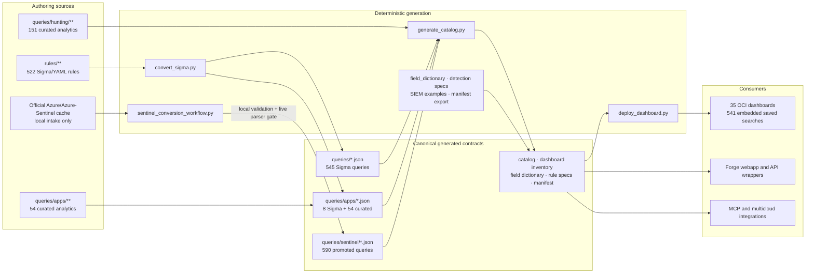
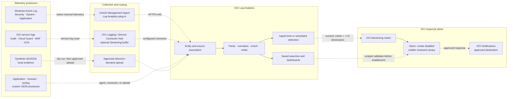
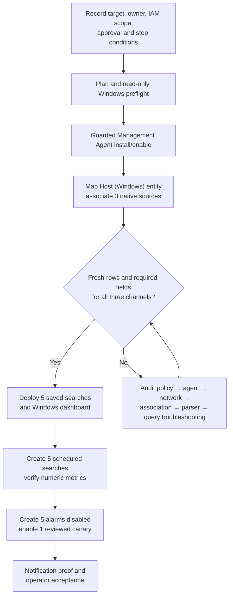
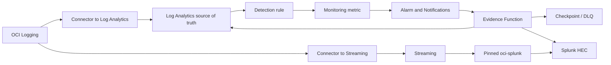
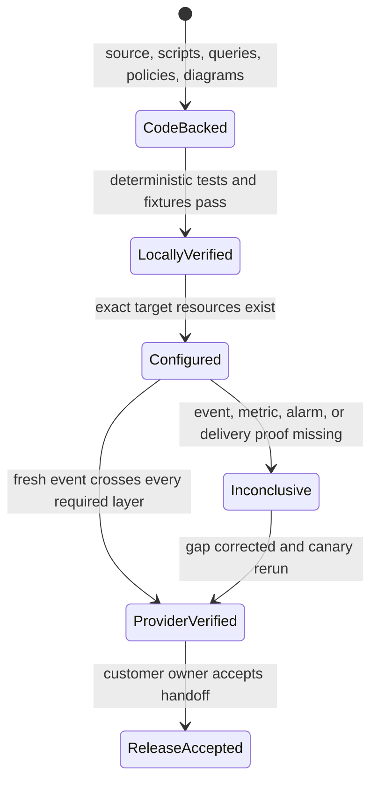

# OCI Log Analytics Detections Architecture

Last reconciled with generated artifacts: 2026-09-01

## Purpose and scope

This repository is an independent, tenant-neutral accelerator for OCI Log Analytics detection engineering. It provides:

1. source-authored Sigma/YAML detections;
2. deterministic Sigma and Microsoft Sentinel conversion workflows;
3. curated application, browser, WAF, geographic, and hunting analytics;
4. source, parser, field, saved-search, dashboard, detection-rule, and example-log artifacts;
5. synthetic evidence generators and guarded ingestion helpers;
6. manual and script-assisted Windows Event Log onboarding;
7. OCI Log Analytics dashboards, saved searches, scheduled detections, and alarm plans; and
8. the integrated Forge webapp plus generated contracts for API, MCP, and multicloud consumers.

It is not a hosted SIEM, a credential broker, or proof that content is deployed in a customer tenancy. Forge and repository automation do not own customer credentials, select the target compartment, or silently enable alarms. Live OCI changes require an explicitly configured target and current approval.

## System boundaries

| Boundary | Responsibility | Must not do |
|---|---|---|
| Authoring | Maintain `rules/**` and curated query JSON | Hand-edit generated Sigma or promoted Sentinel output |
| Generation | Convert sources and build catalogs, dictionaries, examples, and inventories | Invent fields or treat local Sentinel conversion as promotion |
| Validation | Check schema, query shape, dashboard layout, sensitive values, and generated drift | Upgrade a local pass into provider verification |
| Deployment | Create/reconcile sources, saved searches, dashboards, scheduled rules, and reviewed alarms | Infer the tenancy, apply unreviewed IAM, or enable every alarm automatically |
| Forge/API/MCP | Read generated artifacts and expose conversion/inventory experiences | Duplicate conversion, catalog, or dashboard deployment logic |
| Customer operations | Select the tenancy, IAM scope, sources, retention, alarm destinations, and acceptance criteria | Delegate approval implicitly to this repository |

## Current generated inventory

Published counts come from [`queries/catalog.json`](../queries/catalog.json), [`queries/dashboard_inventory.json`](../queries/dashboard_inventory.json), and `test_data/manifest.json`, not from hand-maintained release notes.

| Surface | Current count | Authority |
|---|---:|---|
| Source Sigma/YAML rules | 522 | `queries/catalog.json:inventory.source_yaml_rules` |
| Top-level Sigma-derived OCI queries | 545 | `queries/catalog.json:inventory.generated_base_detection_queries` |
| Sigma-derived browser/app queries | 8 | `queries/catalog.json:inventory.source_derived_app_queries` |
| Promoted Sentinel queries | 590 | `queries/catalog.json:total_sentinel_queries` |
| Curated app analytics | 54 | `queries/catalog.json:inventory.curated_app_queries` |
| Curated hunting analytics | 151 | `queries/catalog.json:total_hunting` |
| Total query content | 1,348 | `queries/catalog.json:total_content_items` |
| Dashboards | 35 | `queries/dashboard_inventory.json:summary.total_dashboards` |
| Dashboard saved searches/widgets | 541 | `queries/dashboard_inventory.json:summary.total_widgets` |
| Advanced visualization widgets | 161 | `queries/dashboard_inventory.json:summary.advanced_visualization_widgets` |
| Latest local synthetic events | 93,142 across 25 NDJSON files | `test_data/manifest.json` |

The 553 Sigma-derived queries are the 545 top-level queries plus 8 browser/app queries. The 205 curated analytics are 54 app queries plus 151 hunting queries. Sentinel content is source-derived but is not counted as Sigma-derived.

## Repository content architecture



Editable diagram sources:

- [project content architecture Mermaid](diagrams/project-content-architecture.mmd)
- [project content architecture JSON specification](diagrams/project-content-architecture.json)
- [Windows access architecture Mermaid](diagrams/windows-access-architecture.mmd)
- [Windows access architecture JSON specification](diagrams/windows-access-architecture.json)

The JSON specifications and Mermaid files are tenant-neutral design artifacts. Structural validation proves their format and active-content safety; it does not prove a deployed OCI topology.

## Canonical artifact ownership

| Artifact | Owner/generator | Consumer contract |
|---|---|---|
| `rules/**` | Hand-authored | Source of truth for Sigma-derived detections |
| `queries/*.json`, Sigma files in `queries/apps/` | `scripts/convert_sigma.py` | OCI Log Analytics query payloads |
| `queries/sentinel/*.json` | `scripts/sentinel_conversion_workflow.py` | Promoted, live-parser-passing Sentinel conversions only |
| Curated `queries/apps/*.json` and `queries/hunting/*.json` | Hand-authored | Supported app and hunting analytics |
| `queries/catalog.json`, `CATALOG.md` | `scripts/generate_catalog.py` | Authoritative content counts and coverage |
| `queries/dashboard_inventory.json` | `scripts/deploy_dashboard.py --export-inventory` | Dashboard/widget/query mapping |
| `queries/log_source_field_dictionary.json` | `scripts/field_dictionary.py` | Approved source/display-field dictionary |
| `queries/detection_rule_specs.json` | `scripts/detection_rule_creator.py` | Scheduled-search rule specifications |
| `queries/siem_log_examples.json` | `scripts/generate_siem_log_examples.py` | Redacted parser-development examples |
| `queries/manifest.json` | `scripts/export_for_multicloud.py --manifest-only` | Derivative integration manifest |
| `webapp/**` | Next.js application | Reads generated contracts; does not own generation |

`logandetectionqueries/` and `logandetectionrules/` are legacy surfaces and must not receive hand-authored content. Generated report/inventory JSON is not a runnable saved search and must be excluded from query walkers.

## Runtime telemetry architecture

Collection, storage, query, visualization, alerting, and response are separate layers. There is no universal requirement for all data to traverse Streaming.



### Route selection

| Source/use case | Preferred route | Key contract |
|---|---|---|
| Windows Security/System/Application | Management Agent, Host (Windows) entity, three native source associations | Prove fresh parsed events before creating detection rules |
| OCI service logs | OCI Logging and a reviewed Service Connector Hub route; Streaming is optional | Confirm the exact service log, compartment, connector, and target |
| Application/browser telemetry | `SOC Application Logs` custom JSON source | Use OCI display fields such as `Service Name`, `Trace ID`, and `Response Code` |
| Sysmon-rich/custom JSON | Repository custom source/parser where required fields are declared | Do not assume a minimalist native parser exposes every detection field |
| Synthetic evidence | Local generation/validation first; approved upload only afterward | Synthetic hits prove query contracts, not production coverage |

## Windows access onboarding workflow

The Windows access use case is a complete vertical slice for Security, System, and Application channels and the event IDs 4624, 4625, 4634, 4648, 4672, 4720, 4726, 4732, 4733, and 4776.



Operator entry points:

- [fast onboarding overview](WINDOWS_ACCESS_FAST_ONBOARDING.md)
- [manual console runbook](WINDOWS_ACCESS_MANUAL_RUNBOOK.md)
- [script-assisted runbook](WINDOWS_ACCESS_SCRIPTED_RUNBOOK.md)
- [collection, alerting, troubleshooting, and evidence diagrams](WINDOWS_ACCESS_WORKFLOW_DIAGRAMS.md)
- [`scripts/windows/management_agent_access_setup.ps1`](../scripts/windows/management_agent_access_setup.ps1) for offline plan, read-only preflight, and explicitly confirmed install/enable
- [`scripts/windows_access_onboarding.py`](../scripts/windows_access_onboarding.py) for local alert evaluation and reviewable association/task/alarm bundles
- [`scripts/windows_eventlog_synthetic.py`](../scripts/windows_eventlog_synthetic.py) for deterministic fixtures and guarded upload

Scripts reduce manual transcription; they do not lower the IAM, target, validation, or approval gates. Saved-search OCIDs remain blocking placeholders until the searches exist in the target tenancy, and generated alarms remain disabled until a metric and destination canary are reviewed.

## Splunk parallel delivery architecture

Splunk integration adds two explicit runtime paths without changing canonical query ownership:



- **Mode 1, raw:** the separate Connector Hub → Streaming → pinned `adibirzu/oci-splunk` path owns raw transport and consumer offsets.
- **Mode 2, evidence:** Log Analytics detection metrics trigger a bounded query and normalized HEC envelope; checkpoint advances only after HEC confirmation.
- **Hybrid:** delivery policy is explicit per source and detection. On-premises Management Agent/optional Management Gateway sources can remain in Log Analytics and use Mode 2 without Streaming.

The architecture keeps collection, parsing, query, detection rule, Monitoring metric, alarm, Notifications, Function, checkpoint/DLQ, HEC confirmation, Splunk searchability, and provider acceptance independently observable. The exporter is opt-in and alarm actions/subscription default to disabled.

Operator procedures are in [Splunk Parallel Operations](SPLUNK_PARALLEL_OPERATIONS.md), [Rule Migration](SPLUNK_RULE_MIGRATION.md), [Evidence Export Runbook](SPLUNK_EVIDENCE_EXPORT_RUNBOOK.md), and [E2E Validation](SPLUNK_E2E_VALIDATION.md). Editable full diagrams: [overview](diagrams/logan-splunk-architecture.mmd), [raw fan-out](diagrams/logan-splunk-raw-fanout.mmd), [evidence export](diagrams/logan-splunk-evidence-export.mmd), [sequence](diagrams/logan-splunk-export-sequence.mmd), [IAM](diagrams/logan-splunk-iam-boundaries.mmd), [replay](diagrams/logan-splunk-replay-state.mmd), [on-prem](diagrams/logan-splunk-onprem-agent.mmd), [validation](diagrams/logan-splunk-validation.mmd), and [troubleshooting](diagrams/logan-splunk-troubleshooting.mmd).

## Dashboard, detection, and alert boundaries

- Dashboard composition belongs in `scripts/deploy_dashboard.py:DASHBOARDS` and uses the 12-column layout resolver.
- Dashboard widgets embed saved searches; query metadata carries visualization, time-window, layout, and investigation prompts.
- `stats` rollups normally use `summary_table`; `timestats` trends require an explicit `line` configuration. A parser-valid query is not automatically render-safe.
- An ingest-time detection is appropriate for source/parser labels. A scheduled-search detection is appropriate for LAQL aggregation or correlation.
- A scheduled query emits one numeric metric and no more than three dimensions into Monitoring.
- A Log Analytics detection rule is not an alarm. Monitoring evaluates the emitted metric; an alarm and Notifications destination are configured separately.
- Validate the query, dashboard rendering, first metric, alarm canary, and notification delivery as distinct gates.

## Field and parser invariants

- Every query field must resolve to a real OCI Log Analytics display field or an approved converter built-in.
- Browser/app content stays on `SOC Application Logs` and its quoted display-field contract.
- Source candidate ordering in `scripts/oci_config.py` is semantic: a custom parser may be required for fields omitted by a native parser.
- String fields such as `Event ID`, `Logon Type`, `Response Code`, and `Status` require quoted comparisons.
- Do not place unresolved templates or LAQL colon parameters in deployable saved searches.
- Sentinel local conversion is not promotion. Only the live-gated workflow may write promoted JSON under `queries/sentinel/`.
- Keep query dimensions low-cardinality and account for late-arriving logs in short scheduled windows.

## Forge and downstream consumers

`webapp/` exposes Forge as the integrated browser surface. Server-side typed loaders consume generated query references, cross-QL mappings, examples, the catalog, dashboard inventory, SIEM examples, and the synthetic manifest. API wrappers, MCP, and multicloud integrations use the same artifacts.

Forge may prepare a Resource Manager handoff, but the customer selects the tenancy and compartment, reviews the plan, and applies it with their own OCI identity. Frontend code must not duplicate Sigma conversion, Sentinel promotion, catalog generation, or dashboard deployment logic.

## Evidence progression



Evidence labels are not interchangeable:

| Class | Minimum evidence |
|---|---|
| Code-backed | Committed/working-tree implementation and reviewable configuration |
| Locally verified | Relevant deterministic tests, generators, link checks, and diagram validation pass |
| Configured | Exact target agent/entity/source/content resources are read back from OCI |
| Provider verified | A fresh authorized event is collected, parsed, queried, emitted as a metric when required, and delivered through the canary path |
| Release accepted | The named customer/operator owner accepts the evidence and operating handoff |

An active agent, imported dashboard, HTTP success, or locally matching fixture cannot by itself close provider or release acceptance.

## Validation workflow

Run focused checks first, followed by the repository release gate:

```bash
python3 -m pytest -q \
  scripts/test_windows_access_onboarding.py \
  scripts/test_windows_eventlog_synthetic.py \
  scripts/test_deploy_dashboard.py \
  scripts/test_setup_log_sources.py \
  scripts/test_check_inventory_drift.py
python3 scripts/deploy_dashboard.py --validate
python3 scripts/deploy_dashboard.py --dry-run
python3 scripts/release_checklist.py
```

When source content changes, regenerate only through its owner:

```bash
python3 scripts/convert_sigma.py
python3 scripts/generate_catalog.py
python3 scripts/deploy_dashboard.py --export-inventory
python3 scripts/export_for_multicloud.py --manifest-only
python3 scripts/audit_rule_quality.py --report docs/RULE_QUALITY_REPORT.md
```

Live validation is a separate, explicitly authorized workflow. Before it starts, resolve the exact OCI profile/account, region, compartment, namespace, log group, resources, owner, action, blast radius, stop conditions, and cleanup/rollback plan. Sanitize receipts before publication.

## Limitations

- Counts describe the checked-in/generated repository state, not a customer deployment.
- Promoted Sentinel queries carry live parser-validation evidence from their promotion workflow; that does not prove data availability or detection hits in every tenancy.
- The Mermaid diagrams use service labels rather than official OCI stencil fidelity. The editable source was generated and structurally validated offline; no external renderer or tenancy was contacted.
- Retention, ingestion cost, Monitoring cardinality, Notifications destinations, and response automation remain customer design decisions.
