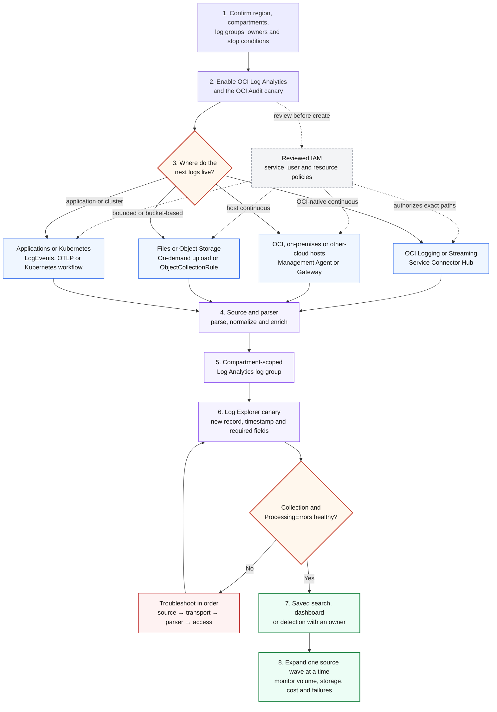

# OCI Log Analytics Fast Onboarding Track

This track helps a customer enable OCI Log Analytics, ingest a small but useful
set of logs, prove that the data is searchable, and leave with a safe production
rollout plan. The target is a **60–90 minute first working path**, followed by a
governed expansion rather than an immediate all-source migration.

For a Windows Server access-monitoring rollout, continue with
[Windows Access Monitoring Fast Onboarding](WINDOWS_ACCESS_FAST_ONBOARDING.md).
That use case includes a [manual console runbook](WINDOWS_ACCESS_MANUAL_RUNBOOK.md),
a [script-assisted runbook](WINDOWS_ACCESS_SCRIPTED_RUNBOOK.md), and an editable
[workflow diagram set](WINDOWS_ACCESS_WORKFLOW_DIAGRAMS.md).
It reuses this track's IAM and ingestion decisions and adds Management Agent
host steps, native Windows source association, five alert-ready searches, a
focused dashboard, deterministic fixtures, and local/provider E2E gates.

> **Evidence boundary:** this guide is documentation-backed and uses
> tenancy-neutral examples. It has not verified a customer's tenancy, identity
> domain, region, network, data, or service limits. A console success message,
> connector in `ACTIVE`, or an empty query is not end-to-end ingestion proof.

## Outcome and exit criteria

At the end of the fast track, the customer should have:

- one deliberately selected OCI region with Log Analytics enabled;
- named operator roles and reviewed IAM policies;
- a compartment and log-group design that enforces the intended data access;
- OCI Audit Logs flowing as the first canary source;
- one additional representative source using the right ingestion method;
- parsed records with a correct timestamp and useful fields in Log Explorer;
- a saved validation query and an owner for ingestion health, storage, and cost;
- a documented next wave, rollback/stop condition, and unresolved coverage gaps.

This is **provider verified** only after records generated after collection was
enabled are visible in Log Explorer and the ingestion health checks are clean.

## 90-minute agenda

| Time | Activity | Proof to retain |
|---|---|---|
| 0–10 min | Confirm target and make the key design choices | Region, compartments, log groups, first two sources |
| 10–25 min | Enable Log Analytics with the OCI onboarding workflow | Reviewed policies, regional service enabled, target log group |
| 25–45 min | Configure OCI Audit Logs as the canary | New Audit records visible in Log Explorer |
| 45–65 min | Add one representative source | Source-specific records and parsed fields visible |
| 65–80 min | Validate query, time, identity, and ingestion health | Saved query plus screenshots or redacted counts |
| 80–90 min | Agree production waves and ownership | Signed-off checklist, risks, next source and owner |

Oracle recommends the streamlined console onboarding and **Add Data** workflows
for the minimum prerequisites and rapid ingestion. See the official
[Quick Start](https://docs.oracle.com/en-us/iaas/log-analytics/doc/quick-start.html),
[10-minute Quick Start Guide](https://docs.oracle.com/en/cloud/paas/log-analytics/logqs/),
and [Ingest Logs overview](https://docs.oracle.com/en-us/iaas/log-analytics/doc/ingest-logs.html).

## Onboarding and ingestion workflow



Solid arrows show the onboarding or telemetry path. Dotted arrows show IAM and
configuration control. The red loop is the fail-closed path: do not expand to
the next source until a newly generated record is queryable and collection
health is clean. This is a **documentation-backed design**, not a diagram of a
verified customer tenancy.

## Step 1 — Decide the boundary before enabling anything

Record these values in the customer's change record. Do not put OCIDs, tenancy
namespaces, internal hostnames, or real IP addresses in this repository.

| Decision | Fast-track recommendation | Production question |
|---|---|---|
| Region | Use one approved region for the canary | Residency, latency, DR, and operations ownership |
| Resource compartment | A dedicated observability compartment | Who manages entities, rules, and connectors? |
| Log groups | Separate at least production/security from non-production | Who may search each data class? |
| First source | OCI Audit Logs | Is subcompartment collection intended? |
| Second source | One high-value, low-risk source | OCI service, host file, syslog, OTLP, bucket, or API? |
| Time | Emit and parse timestamps in UTC | Which field is event time versus collection time? |
| Retention | Set an approved initial objective before broad ingestion | Active versus archive duration and purge authority |
| Stop condition | Stop if the target, policy scope, parser, or volume is wrong | Who can approve remediation or expansion? |

Log Analytics is regional, and log groups are the access-control boundary for
stored logs. Oracle recommends planning them by data type, entity/environment,
or customer and avoiding a single catch-all group. See
[Enable Access to Log Analytics](https://docs.oracle.com/en-us/iaas/log-analytics/doc/enable-access-logging-analytics-its-resources.html)
and [Best Practices](https://docs.oracle.com/en-us/iaas/log-analytics/doc/best-practices.html).

## Step 2 — Enable the service and establish user access

For the first regional enablement, an OCI tenancy Administrator opens
**Observability & Management → Log Analytics**, selects **Start Using Log
Analytics**, reviews the proposed policies and log group, and then configures
OCI Audit Log collection. Do not accept the wizard output without reviewing its
scope. Oracle documents the exact resources and policies created by the
workflow in [Policies Created While Onboarding Log Analytics](https://docs.oracle.com/en-us/iaas/log-analytics/doc/policies-created-while-onboarding-logging-analytics.html).

### Minimum service policy

Oracle documents this tenancy-level service policy as a prerequisite:

```text
allow service loganalytics to READ loganalytics-features-family in tenancy
```

### Recommended separation of duties

Replace the example group and compartment names with customer-approved values.
The feature-family grant must be at tenancy/root level; resource-family and
dashboard access can be scoped to the compartments that contain the resources.

**Analysts — search and view, no collection changes**

```text
allow group <IDENTITY_DOMAIN>/<LA_ANALYST_GROUP> to read loganalytics-features-family in tenancy
allow group <IDENTITY_DOMAIN>/<LA_ANALYST_GROUP> to read loganalytics-resources-family in compartment <LA_COMPARTMENT>
allow group <IDENTITY_DOMAIN>/<LA_ANALYST_GROUP> to use management-dashboard-family in compartment <LA_COMPARTMENT>
allow group <IDENTITY_DOMAIN>/<LA_ANALYST_GROUP> to read compartments in tenancy
```

**Log Analytics administrators — configure collection and dashboards**

```text
allow group <IDENTITY_DOMAIN>/<LA_ADMIN_GROUP> to use loganalytics-features-family in tenancy
allow group <IDENTITY_DOMAIN>/<LA_ADMIN_GROUP> to use loganalytics-resources-family in compartment <LA_COMPARTMENT>
allow group <IDENTITY_DOMAIN>/<LA_ADMIN_GROUP> to manage management-dashboard-family in compartment <LA_COMPARTMENT>
allow group <IDENTITY_DOMAIN>/<LA_ADMIN_GROUP> to read compartments in tenancy
```

Reserve `MANAGE loganalytics-features-family` and purge/lifecycle permissions
for a small super-administrator group. Do not give analysts or routine
collection operators purge rights. Use the
[Prerequisite IAM Policies](https://docs.oracle.com/en-us/iaas/log-analytics/doc/prerequisite-iam-policies.html),
[IAM Policies Catalog](https://docs.oracle.com/en-us/iaas/log-analytics/doc/iam-policies-catalog-logging-analytics.html),
and Oracle-defined policy templates as the current authority before creating a
policy. Identity-domain syntax and compartment scope must be validated in the
target tenancy.

## Step 3 — Choose how the data moves

Start from where the logs already exist; do not create an avoidable extra hop.

| Logs live in / requirement | Preferred path | Best fit | Key caveat |
|---|---|---|---|
| OCI Logging service, including OCI service logs | **Service Connector Hub → Log Analytics** | Fastest OCI-native continuous path | Connector start time is not historical backfill |
| OCI Streaming | **Service Connector Hub → Log Analytics** | High-volume custom streaming data | Validate source/parser and connector filters |
| OCI Compute host | **Management Agent via Oracle Cloud Agent** | Continuous files, Windows events, syslog, ODL, DB and host sources | Agent needs host file permissions and outbound endpoints |
| On-premises or other-cloud host | **Standalone Management Agent**, optionally through Management Gateway | Continuous files, syslog listener, REST, Windows events | Plan network egress, certificates, proxy and agent lifecycle |
| A bounded file or incident evidence set | **On-demand upload** | Fast canary, historic/ad-hoc analysis | Not a continuous pipeline; source is mandatory |
| Application emits OpenTelemetry logs | **UploadOtlpLogs API** | OTLP JSON/GZIP with trace/span context | Direct API upload, not a collector endpoint assumption |
| Application can push JSON events | **LogEvents API** | Programmatic event batches | Observe payload/size limits and signing requirements |
| Logs accumulate in OCI Object Storage | **ObjectCollectionRule** | Historic, live, or historic-plus-live bucket collection | LIVE modes also use Events and a dedicated public-endpoint Stream |
| Kubernetes | **Kubernetes Monitoring Add Data workflow** | Cluster logs, metrics, object discovery, modeled entities, and dashboards | Start with the [OKE Monitoring One Pager](OKE_MONITORING_ONE_PAGER.md); validate cluster scope and required policies first |
| Enterprise Manager Cloud Control | **EM Bridge** | Existing EM entity model and target logs | Treat as its own integration workstream |
| Agent cannot be used but Fluentd already exists | **OCI Log Analytics Fluentd output plugin** | Exception path for existing Fluentd estates | Oracle recommends Management Agent for the best experience |

The complete, current routing list is in Oracle's
[Ingest Logs](https://docs.oracle.com/en-us/iaas/log-analytics/doc/ingest-logs.html)
and [Architecture of Log Analytics](https://docs.oracle.com/en-us/iaas/log-analytics/doc/architecture-logging-analytics.html).
Cross-tenancy collection is intentionally not a fast-track default; design and
review the `admit`/`endorse` policies separately.

### Optional Splunk parallel branch

Choose per source, after Log Analytics collection/parsing proof:

- **Mode 1 raw:** add a separate Logging → Connector Hub → Streaming route and use a reviewed pinned `adibirzu/oci-splunk` tag/commit for the consumer/HEC path. Do not change the Log Analytics connector or track mutable `main` in production.
- **Mode 2 evidence:** keep Log Analytics as source of truth; enable a migrated detection rule, prove its Monitoring metric, then use the alarm → Notifications → Function → bounded query → HEC path.
- **Hybrid:** record both choices and accept duplicate-ingest, retention, privacy, egress, and Splunk-license costs explicitly.

On-premises Management Agent sources, optionally proxied by Management Gateway, can use Mode 2 after entity/source/field proof and do not need Streaming. Start with [Splunk Parallel Operations](SPLUNK_PARALLEL_OPERATIONS.md); use the [export runbook](SPLUNK_EVIDENCE_EXPORT_RUNBOOK.md) and [E2E gates](SPLUNK_E2E_VALIDATION.md) only after the base onboarding exit criteria pass. Editable path: [onboarding diagram](diagrams/logan-splunk-onboarding.mmd).

## Step 4 — Run the OCI-native canary

1. In Log Analytics, open **Add Data**.
2. Under **Security and Compliance**, select OCI Audit Logs.
3. Confirm the source compartments and whether subcompartments are included.
4. Confirm the target Log Analytics log group.
5. Review the policies and Service Connector before creating them.
6. Generate or wait for a new, harmless Audit event in scope.
7. In Log Explorer, select a recent time window and run:

```text
'Log Source' = 'OCI Audit Logs' | stats count by 'Principal Name' | sort -count
```

Keep the time window in the Log Explorer controls or API `TimeRange`, not in a
saved query string. If the query is empty, widen the window, verify source and
subcompartment scope, and inspect ingestion errors before drawing a conclusion.

### Manual Service Connector policy pattern

The console can propose these policies. For manual setup, Oracle documents the
following pattern; bind it to the exact connector and destination log group:

```text
allow any-user to {LOG_ANALYTICS_LOG_GROUP_UPLOAD_LOGS} in compartment id <LA_LOG_GROUP_COMPARTMENT_OCID> where all {request.principal.type = 'serviceconnector', target.loganalytics-log-group.id = '<LA_LOG_GROUP_OCID>', request.principal.compartment.id = '<SERVICE_CONNECTOR_COMPARTMENT_OCID>'}
allow group <IDENTITY_DOMAIN>/<CONNECTOR_OPERATOR_GROUP> to MANAGE serviceconnectors in tenancy
allow group <IDENTITY_DOMAIN>/<CONNECTOR_OPERATOR_GROUP> to READ logging-family in tenancy
```

The first statement is constrained to a service-connector principal, one target
log group, and one connector compartment. Review whether the operator grants can
be narrowed for the customer's compartment design. For resource enrichment and
automatic entity creation, Log Analytics may also need `read` access to the
specific source resource type. Use the service-specific table in
[Ingest Logs from Other OCI Services Using Service Connector](https://docs.oracle.com/en-us/iaas/log-analytics/doc/ingest-logs-from-other-oci-services-using-service-connector.html).

## Step 5 — Add one representative source

### Option A: continuous host collection with Management Agent

Use the Add Data wizard. On OCI Compute, prefer enabling Management Agent through
Oracle Cloud Agent; for other hosts, install the standalone agent with the Log
Analytics plugin. The agent path is:

```text
host log → Management Agent → source/entity association → parser/enrichment → log group
```

Oracle's documented baseline includes an operator group, a Management Agent
dynamic group, and upload/metrics permissions:

```text
allow group <IDENTITY_DOMAIN>/<AGENT_OPERATOR_GROUP> to manage management-agents in compartment <AGENT_COMPARTMENT>
allow group <IDENTITY_DOMAIN>/<AGENT_OPERATOR_GROUP> to manage management-agent-install-keys in tenancy
allow group <IDENTITY_DOMAIN>/<AGENT_OPERATOR_GROUP> to read metrics in compartment <AGENT_COMPARTMENT>
allow group <IDENTITY_DOMAIN>/<AGENT_OPERATOR_GROUP> to read users in tenancy
```

Dynamic-group matching rule:

```text
ALL {resource.type='managementagent', resource.compartment.id='<AGENT_COMPARTMENT_OCID>'}
```

Dynamic-group policies:

```text
allow dynamic-group <IDENTITY_DOMAIN>/<MANAGEMENT_AGENT_DYNAMIC_GROUP> to use metrics in tenancy
allow dynamic-group <IDENTITY_DOMAIN>/<MANAGEMENT_AGENT_DYNAMIC_GROUP> to {LOG_ANALYTICS_LOG_GROUP_UPLOAD_LOGS} in tenancy
```

Review a narrower upload scope against the current policy catalog and the exact
target architecture. Confirm the agent user can read the intended files. For
network egress, the agent must reach the regional Log Analytics and telemetry
ingestion endpoints documented in
[Install Management Agents](https://docs.oracle.com/en-us/iaas/log-analytics/doc/install-management-agents.html).
Then create or reuse the entity, select an Oracle-defined source/parser where
possible, associate the source with the entity, and check collection warnings
and upload metrics. The hands-on
[30-minute continuous collection tutorial](https://docs.oracle.com/en/cloud/paas/log-analytics/laagt/)
is a useful lab companion.

### Option B: on-demand canary or historic file

Prepare the matching source, target log group, and optional entity, then use
**Administration → Uploads → Upload Files**. A least-privilege documented policy
set for create/get/list is:

```text
allow group <IDENTITY_DOMAIN>/<UPLOAD_GROUP> to {LOG_ANALYTICS_LOG_GROUP_UPLOAD_LOGS} in compartment <LA_LOG_GROUP_COMPARTMENT>
allow group <IDENTITY_DOMAIN>/<UPLOAD_GROUP> to {LOG_ANALYTICS_ENTITY_UPLOAD_LOGS} in compartment <ENTITY_COMPARTMENT>
allow group <IDENTITY_DOMAIN>/<UPLOAD_GROUP> to {LOG_ANALYTICS_SOURCE_READ} in tenancy
allow group <IDENTITY_DOMAIN>/<UPLOAD_GROUP> to use loganalytics-ondemand-upload in tenancy
```

Delete-upload permissions are separate and should not be granted for routine
ingestion. Check the current size, file-count, archive, and source-type limits in
[Upload Logs on Demand](https://docs.oracle.com/en-us/iaas/log-analytics/doc/upload-logs-demand.html).

### Option C: Object Storage collection

Use this when a bucket is already the system of exchange and collection must be
historic, live, or both. Create or reuse a matching source, target log group,
optional entity, and—for LIVE modes—a dedicated public-endpoint Stream. The
operator needs access to the collection rule, target log group/source, bucket
objects, and stream. The collection resource also needs a dynamic group:

```text
ALL {resource.type='loganalyticsobjectcollectionrule'}
```

Grant that dynamic group only the required bucket/object reads, Events-rule
management, compartment inspection, Oracle tag-namespace use, and Stream
consume permissions shown in Oracle's
[Object Storage collection guide](https://docs.oracle.com/en-us/iaas/log-analytics/doc/collect-logs-from-your-oci-object-storage-bucket.html).
Do not reuse a private-endpoint Stream or modify the Event rule created by Log
Analytics; both are documented collection constraints.

### Option D: API and OpenTelemetry uploads

- Use the [LogEvents API](https://docs.oracle.com/en-us/iaas/log-analytics/doc/upload-event-logs-using-logevents-api.html)
  for signed JSON event batches with a mandatory log group and source.
- Use [Upload OpenTelemetry Logs](https://docs.oracle.com/en-us/iaas/log-analytics/doc/upload-opentelemetry-logs.html)
  for OTLP JSON/GZIP. It uses the Oracle-defined OpenTelemetry Logs source by
  default and can map OTLP attributes to Log Analytics fields.

Both need upload permission on the destination log group. Do not embed API keys,
namespace values, or OCIDs in source control; resolve them at runtime.

## Step 6 — Validate the complete data path

Validate a **new event created after enablement**, not only sample or historical
data. Retain redacted evidence for each layer:

| Layer | Validation | Failure signal |
|---|---|---|
| Collection | Agent/source association, connector source/filter, bucket rule, or upload status is correct | Disabled association, wrong compartment/filter, rejected file |
| Transport | Connector tracking logs, agent upload metrics, API response, or Stream/Events health | Delivery errors, network/TLS/proxy failure, stream lag |
| Processing | `ProcessingErrors` metric and processing-error details | Unknown source, parser failure, bad timestamp, field/type mismatch |
| Storage/access | Correct Log Analytics log group and analyst access | Data in wrong group or unauthorized query |
| Query | Source-wide count first, then required fields | Empty window, child compartment omitted, wrong display field/type |
| Use case | One saved search or dashboard answers a named question | Rows exist but cannot drive the intended operation |

Start broad, then narrow:

```text
* | stats count by 'Log Source' | sort -count
```

```text
'Log Source' = '<SOURCE_DISPLAY_NAME>' | stats count
```

```text
'Log Source' = '<SOURCE_DISPLAY_NAME>' | fields Time, Entity, msg | sort -Time | head 20
```

Important query rules from the OCI Log Analytics skill and Oracle query model:

- quote multi-word display fields such as `'Log Source'` and `'Principal Name'`;
- quote values for string-typed fields, even when they look numeric;
- keep the time range outside the saved OCL string;
- include subcompartments when the intended scope contains child compartments;
- treat an empty result as inconclusive until source, region, scope, time,
  permissions, pagination, parser, and transport are checked.

After the customer proves ingestion, use this repository's
[query usage guide](LOG_ANALYTICS_QUERY_USAGE.md) to run and adapt detections.
Repository tests and synthetic data are **locally verified** evidence; they do
not prove the customer's collection path or parser behavior.

## Step 7 — Productionize in small waves

Recommended source waves:

1. **Control plane:** OCI Audit Logs and a narrow set of security services.
2. **Network edge:** VCN Flow Logs, Load Balancer/WAF, DNS where applicable.
3. **Identity and hosts:** identity audit, Linux/Windows sources, endpoint data.
4. **Applications:** structured application logs, OTLP context, database logs.
5. **External/multicloud:** Management Gateway, approved API, bucket, or
   cross-tenancy patterns with a separate security review.

For every new source, capture owner, purpose, expected daily volume, log group,
source/parser, event-time field, sensitive fields, retention, validation query,
alert/detection use cases, failure response, and offboarding steps.

### Storage, cost, and lifecycle

- Measure `ActiveStorageUsed`, `ArchivalStorageUsed`, processing errors, agent
  upload size, and agent upload failures before broadening collection.
- Filter noisy sources at the producer or connector only after confirming the
  events are not required for audit, detection, or incident response.
- Use UTC timestamps and validate timestamp parsing before historic ingestion.
- Define retention with security, privacy, legal, and operations owners.
- Archive or purge only through reviewed lifecycle policies. Purge is
  destructive and is outside this fast track.
- Recheck current commercial terms with the
  [OCI Log Analytics pricing page](https://www.oracle.com/manageability/logging-analytics/pricing/)
  rather than copying a price into a long-lived runbook.

See [Manage Storage](https://docs.oracle.com/en-us/iaas/log-analytics/doc/manage-storage.html)
for active/archive behavior, recall implications, and purge controls.
Use [Cost Optimization and Archive Retention](LOG_ANALYTICS_COST_OPTIMIZATION.md)
for the operator workflow, the service-metric watchlist, archive advantages, and
the Splunk Mode 1 versus Mode 2 cost tradeoff.

## Troubleshooting order

1. Confirm region, tenancy, compartment, log group, and identity-domain group.
2. Confirm a new event exists at the producer.
3. Confirm the collection object and source filter/association.
4. Confirm connector, agent, API, Event, Stream, or network delivery health.
5. Inspect `ProcessingErrors` and agent collection warnings.
6. Confirm source internal name and display name; include Oracle system sources
   when listing inventory.
7. Test parser output and event-time extraction with one sanitized record.
8. Query a wider time window and include the intended compartment subtree.
9. Confirm the analyst can read the destination log group.
10. Escalate with a redacted request ID, timestamp, region, method, and failure
    layer—never with credentials or raw customer logs.

Oracle's [Troubleshoot Ingestion Pipeline](https://docs.oracle.com/en-us/iaas/log-analytics/doc/troubleshoot-ingestion-pipeline.html)
maps processing errors to collection methods. Missing logs are a coverage gap,
not evidence that the source produced no events.

## Customer handoff checklist

- [ ] Region, compartment, log groups, owners, and data classes are recorded.
- [ ] IAM policy review completed; no routine user has lifecycle or purge rights.
- [ ] OCI Audit canary is visible and timestamped correctly.
- [ ] One representative second source is visible and parsed correctly.
- [ ] A saved source-wide validation query exists.
- [ ] Connector/agent/API processing health has an owner and alarm/runbook.
- [ ] Retention, archive, purge, and estimated-volume decisions are recorded.
- [ ] Sensitive-field handling and access review are complete.
- [ ] Next source wave and stop conditions are approved.
- [ ] Evidence is redacted; no namespace, OCID, IP, credential, or raw customer
      payload is committed to this repository.

## Official learning and reference set

- [OCI Log Analytics documentation](https://docs.oracle.com/en-us/iaas/log-analytics/home.htm)
- [Quick Start Guide — Audit Logs in about 10 minutes](https://docs.oracle.com/en/cloud/paas/log-analytics/logqs/)
- [Lab — Analyze Sample Logs with OCI Log Analytics](https://docs.oracle.com/en/learn/oci_logging_analytics_tutorial_sample_logs/index.html)
- [Lab — Set Up Continuous Log Collection](https://docs.oracle.com/en/cloud/paas/log-analytics/laagt/)
- [Cloud Adoption Framework — Logging and Log Analytics Strategy](https://docs.oracle.com/en-us/iaas/Content/cloud-adoption-framework/logging-and-logging-analytics-strategy.htm)
- [Best Practices](https://docs.oracle.com/en-us/iaas/log-analytics/doc/best-practices.html)
- [Cost Optimization and Archive Retention](LOG_ANALYTICS_COST_OPTIMIZATION.md)
- [A-Team: OCI Logging Analytics Best Practices Series - Cost Optimization](https://www.ateam-oracle.com/oci-logging-analytics-best-practices-series-cost-optimization)
- [IAM Policies Catalog](https://docs.oracle.com/en-us/iaas/log-analytics/doc/iam-policies-catalog-logging-analytics.html)
- [Ingest Logs](https://docs.oracle.com/en-us/iaas/log-analytics/doc/ingest-logs.html)
