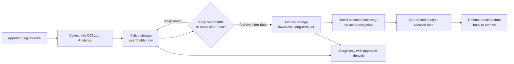

# OCI Log Analytics Cost Optimization and Archive Retention

This guide explains how to keep OCI Log Analytics useful as the primary analysis plane without letting active storage, duplicate forwarding, or long-term retention drift out of control. It is written for operators who need a manual process they can follow even before any automation is approved.

Use this guide together with the [Fast Onboarding Track](FAST_ONBOARDING_TRACK.md), [Splunk Parallel Operations](SPLUNK_PARALLEL_OPERATIONS.md), and Oracle's [Manage Storage](https://docs.oracle.com/en-us/iaas/log-analytics/doc/manage-storage.html) documentation.

## What you get

- A practical decision model for active storage, archive storage, recall, release, and purge.
- The minimum OCI checks to size ingest, monitor storage, and avoid paying twice for unnecessary copies.
- A retention pattern that works whether Log Analytics is the only analysis system or runs in parallel with Splunk.
- A workflow that makes long-term retention explicit before new sources are onboarded.

## Storage workflow

## Core decisions

| Decision | Recommendation | Why it matters |
|---|---|---|
| Active storage window | Keep only the period needed for frequent search, alert tuning, and daily investigations | Active data is the immediately searchable tier and is where unnecessary cost shows up first |
| Archive enablement | Enable archiving when the tenancy has enough active data and older logs still have investigative or compliance value | Oracle documents archive storage as a lower-cost tier for older logs that may still need later analysis |
| Archive retention | Set it with legal, security, privacy, and operations owners | Long-term retention without an owner turns into silent cost growth or unsafe purge decisions |
| Recall process | Recall only the needed time range and release it after analysis | Recalled data counts toward active storage until it is released |
| Purge | Treat purge as destructive and separate from fast onboarding | Purge changes data availability, incident response scope, and legal retention posture |
| Splunk parallel mode | Use Mode 2 by default for governed detections; use Mode 1 only where raw duplication is explicitly justified | Raw fan-out duplicates volume, while detection-evidence export reduces downstream data volume |

## Oracle behaviors to plan around

The current OCI documentation says:

- Archiving is enabled from the Log Analytics storage administration workflow.
- Archiving requires a minimum active data size of 1 TB.
- The minimum active-storage duration before logs can be archived is 30 days.
- Archived logs can be recalled for analysis and released back to archive later.
- Recalled data counts toward active storage until it is released.
- Recall requests are billed based on the active storage they generate.

Those are service behaviors, not project conventions. Recheck the current OCI documentation before final customer rollout because service details can change.

## Manual operator process

### 1. Measure before enabling new sources

In OCI Monitoring, review the Log Analytics service metrics before onboarding a broad source set:

- `ActiveStorageUsed`
- `ArchivalStorageUsed`
- `RecalledStorageInActiveStorageUsed`
- `ProcessingErrors`
- `logCollectionUploadDataSize`
- `logCollectionUploadFailureCount`
- `ScheduledTaskExecutionStatus`

These metrics tell you whether cost is being driven by ingestion growth, archive growth, recalled data left in active storage, parser failures, or excessive agent upload volume. The important storage metrics are shown in OCI Monitoring as Active Storage Used, Archival Storage Used, and Recalled Storage in Active Storage Used.

### 2. Set the source-by-source retention record

For each source, write down:

- owner
- business/security purpose
- expected daily volume
- active retention target
- archive retention target
- whether recall is expected during incident response
- whether the source can be filtered earlier without losing required evidence
- whether the source also needs raw export to Splunk

Do this before broad collection. Otherwise the first retention policy becomes whatever the initial operator happened to click.

### 3. Add budget and anomaly checkpoints

Use OCI Billing and Cost Management to create:

- a budget for the observability or logging cost owner
- alert rules for threshold and forecast drift
- a recurring review of which source families are driving the spend increase

Storage metrics explain technical growth. Budget alerts tell the owner when that growth becomes commercially significant.

### 4. Keep the active tier small on purpose

Use active storage for:

- current investigations
- detection tuning
- dashboards and routine searches
- operational troubleshooting

Move older data to archive when it is no longer part of frequent search but still needs to exist for audit, compliance, hunting backfill, or post-incident recall.

### 5. Recall narrowly, then release

When older data is needed:

1. Recall the smallest useful time range.
2. Filter by log set or search predicate where possible.
3. Use the recalled data for the investigation.
4. Release it back to archive after the work is done.

Leaving recalled data in active storage defeats the point of archive optimization.

### 5a. Optional coldest tier: Object Storage Archive

The A-Team cost-optimization article also describes a second pattern for very
infrequent access: keep the long-term copy outside Log Analytics in Object
Storage Archive tier. This is not the same as native Log Analytics archive.

Use it when:

- the data almost never needs to be queried in Log Analytics
- the restore delay is acceptable
- the team accepts that data must be restored and re-ingested before Log
  Analytics can analyze it again

Operational tradeoff:

- native Log Analytics archive preserves the recall workflow inside Log
  Analytics
- Object Storage Archive can reduce storage cost further for very cold data, but
  recovery takes longer and requires restore plus Object Collection or manual
  upload back into Log Analytics

### 6. Separate purge from archive strategy

Archive is the lower-cost long-term retention path. Purge is a destructive lifecycle decision. Do not treat them as the same thing in onboarding or incident response planning.

## Splunk in parallel

### Mode 1: raw copy plus Log Analytics

Mode 1 duplicates selected OCI Logging data to Splunk through Connector Hub, Streaming, and the pinned [`adibirzu/oci-splunk`](https://github.com/adibirzu/oci-splunk) integration.

Use it when:

- a SOC already depends on raw Splunk searches
- the exact source must exist outside Log Analytics in near-real time
- the team accepts duplicate ingest, storage, retention, and license cost

Cost impact to review:

- OCI Logging plus Connector Hub path
- Streaming partitions and retention
- Splunk HEC ingest and index retention
- Splunk license volume
- possible network egress
- Log Analytics still ingesting the same source

### Mode 2: Log Analytics as source of truth

Mode 2 keeps raw collection and enrichment in Log Analytics, recreates the important detections there, and forwards only bounded evidence after a detection/alarm/exporter workflow runs.

Use it when:

- Log Analytics should be the primary analysis plane
- Splunk needs detection evidence, not every raw record
- privacy, governance, and cost matter more than raw duplication

Cost impact to review:

- Log Analytics ingest, query, active storage, and archive storage
- Monitoring metrics and alarms
- Notifications and Function executions
- Object Storage state and DLQ retention
- reduced Splunk ingest compared with raw fan-out

### On-premises and Management Agent

On-premises logs collected by Oracle Management Agent can follow the same pattern:

- collect the raw source into Log Analytics first
- prove parsing and required fields
- retain recent data in active storage
- archive older data for long-term retention
- export selected evidence to Splunk only if the use case needs it

This avoids adding a second uncontrolled raw path just because the source is on-premises.

## Advantages of keeping long-term logs in Log Analytics archive

- Older logs stay inside the same governed Log Analytics service boundary instead of being split across ad hoc storage paths.
- Investigators can recall archived data back into Log Analytics when they need to run the same saved searches, dashboards, or detections against older periods.
- Archive retention reduces pressure on active searchable storage while preserving a path to later analysis.
- A single retention model makes it easier to explain what stays hot, what becomes cold, and what is eventually purged.
- When Splunk runs in parallel, Log Analytics can remain the normalized history layer while Splunk receives only the data that still adds operational value there.

## Script and CLI pointers

This repository does not enable or change archive settings for a customer tenancy by itself. Use OCI Console or customer-approved CLI/Terraform workflows.

Useful Oracle interfaces to review before a live rollout:

- CLI command group: [Log Analytics storage commands](https://docs.oracle.com/en-us/iaas/tools/oci-cli/latest/oci_cli_docs/cmdref/log-analytics/storage.html)
- `get-storage-usage`
- `enable-archiving`
- `estimate-recall-data-size`
- `recall-archived-data`
- `release-recalled-data`

For Splunk parallel paths, pair this guide with:

- [Splunk Parallel Operations](SPLUNK_PARALLEL_OPERATIONS.md)
- [Splunk Evidence Export Runbook](SPLUNK_EVIDENCE_EXPORT_RUNBOOK.md)
- [Splunk E2E Validation](SPLUNK_E2E_VALIDATION.md)

## Validation checklist

- [ ] The customer has approved active, archive, and purge owners.
- [ ] The active window is sized for frequent investigation, not for indefinite retention.
- [ ] Archive retention is recorded per source or data class.
- [ ] Recall and release steps are written into the incident workflow.
- [ ] `RecalledStorageInActiveStorageUsed` is reviewed so recalled data does not linger.
- [ ] Budget and forecast alerts exist for the owner responsible for storage growth.
- [ ] Mode 1 sources have an explicit duplicate-volume and Splunk-license justification.
- [ ] Mode 2 detections have bounded fields and do not export unnecessary raw payload.
- [ ] On-premises Management Agent sources use the same retention decisions as cloud sources.

## Reference set

- [Oracle Log Analytics: Manage Storage](https://docs.oracle.com/en-us/iaas/log-analytics/doc/manage-storage.html)
- [Oracle Log Analytics: Monitor service metrics](https://docs.oracle.com/iaas/log-analytics/doc/administer-other-actions.html)
- [OCI CLI: Log Analytics storage commands](https://docs.oracle.com/en-us/iaas/tools/oci-cli/latest/oci_cli_docs/cmdref/log-analytics/storage.html)
- [Log Analytics release note: Recalled Storage in Active Storage Used metric](https://docs.oracle.com/en-us/iaas/releasenotes/log-analytics/apr25-storage-mon-metric.htm)
- [OCI Billing and Cost Management](https://docs.oracle.com/en-us/iaas/Content/Billing/home.htm)
- [OCI budget alert rules](https://docs.oracle.com/en-us/iaas/Content/Billing/Tasks/managingalertrules.htm)
- [A-Team: OCI Logging Analytics Best Practices Series - Cost Optimization](https://www.ateam-oracle.com/oci-logging-analytics-best-practices-series-cost-optimization)

Use the A-Team article as supplemental design reading. Use current Oracle documentation for operational facts, limits, and rollout decisions.
