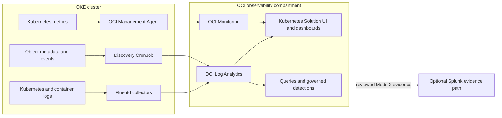

# OKE Monitoring with OCI Log Analytics — One Pager

Use Oracle's [OCI Kubernetes Monitoring Solution](https://github.com/oracle-quickstart/oci-kubernetes-monitoring) to collect Kubernetes logs, metrics, and object metadata from an OKE cluster. The solution combines OCI Log Analytics, OCI Monitoring, OCI Management Agent, and Fluentd and includes Kubernetes-oriented dashboards and topology views.

**Reviewed upstream baseline:** [`oci-onm-4.3.0`](https://github.com/oracle-quickstart/oci-kubernetes-monitoring/releases/tag/oci-onm-4.3.0), published August 11, 2026. Re-check the [latest release](https://github.com/oracle-quickstart/oci-kubernetes-monitoring/releases/latest), release notes, compatibility, and image provenance before each deployment. Pin a reviewed release; do not deploy mutable `main`.

## What the solution collects

| Signal | In-cluster component | OCI destination | Operator value |
| --- | --- | --- | --- |
| Kubernetes, node, and container logs | Fluentd workloads in `oci-onm-logan` | OCI Log Analytics | Search, enrichment, correlation, detections, and retained investigations |
| Kubernetes object state and discovery records | `oci-onm-discovery` CronJob | OCI Log Analytics | Cluster, namespace, workload, pod, service, storage, and event context |
| API server, kubelet/resource, cAdvisor, and computed cluster metrics | `oci-onm-mgmt-agent` | OCI Monitoring, normally `mgmtagent_kubernetes_metrics` | Health, capacity, dashboards, and alarms |

Collection, parsing, query, dashboard rendering, alarm delivery, and downstream SIEM delivery are separate gates. Installing the chart does not by itself prove searchable logs, populated metrics, working dashboards, or Splunk receipt.



## Prerequisites and ownership

- OCI Log Analytics is onboarded in the target region, and the operator has named the exact OCI profile, OKE compartment, observability compartment, cluster, namespace, maintenance window, rollback owner, and cost owner.
- The workstation or OCI Cloud Shell has reviewed `kubectl`, Helm, and OCI CLI versions and access to the intended Kubernetes context. For a private API endpoint, use the upstream manual deployment path from a host that can reach it.
- Keep the Log Analytics log group, Kubernetes Cluster entity, and Management Agent install key in the same observability compartment when using the Solution UI.
- Confirm outbound DNS/TLS and service access from worker nodes. Never place OCI credentials, install-key material, OCIDs, namespaces, cluster names, or endpoints in this repository.
- Review the upstream [README](https://github.com/oracle-quickstart/oci-kubernetes-monitoring/blob/oci-onm-4.3.0/README.md), [IAM guide](https://github.com/oracle-quickstart/oci-kubernetes-monitoring/blob/oci-onm-4.3.0/docs/policies.md), [FAQ](https://github.com/oracle-quickstart/oci-kubernetes-monitoring/blob/oci-onm-4.3.0/docs/FAQ.md), and [upgrade procedure](https://github.com/oracle-quickstart/oci-kubernetes-monitoring/blob/oci-onm-4.3.0/docs/helm-upgrade.md) before applying changes.

## IAM review — least privilege first

Treat the upstream policy file as a template, not as an unreviewed copy-and-paste bundle.

1. **Metrics:** a dynamic group containing only the solution's Management Agents needs permission to publish into the intended observability compartment and the `mgmtagent_kubernetes_metrics` namespace.
2. **Logs and discovery:** for the default OKE instance-principal path, a dynamic group scoped to the intended worker instances needs Log Analytics log-group upload and discovery-upload permissions. For non-OKE/config-file authentication, use a dedicated user group instead.
3. **Installer:** the human or Resource Manager identity needs only the permissions required to create or reuse the approved Log Analytics log group, Kubernetes entity, Management Agent key, and chosen deployment resources.
4. **Optional infrastructure discovery:** cluster, node-pool, VCN, subnet, load-balancer, Logging, Service Connector Hub, and Resource Manager permissions are needed only when that optional feature is selected. Review these broader statements separately.
5. **Kubernetes RBAC:** the solution service account reads Kubernetes objects and metrics endpoints. Review the upstream ClusterRole against the installed chart version and remove unused API groups/resources when the selected configuration permits it.

Do not authorize `any-user`, tenancy-wide discovery, resource-management verbs, or cross-compartment access without confirming the exact upstream feature that requires it and recording the blast radius.

## Choose one installation path

| Method | Use when | Important boundary |
| --- | --- | --- |
| **Log Analytics → Add Data → Kubernetes / Connect Cluster** | Fastest guided OKE onboarding | Review generated IAM and choose manual deployment for a private API endpoint |
| **Helm** | You need version pinning and full values control | Keep private overrides outside Git; render and review before install/upgrade |
| **OCI Resource Manager** | Customer wants OCI-managed Terraform jobs and dashboard import | Review the saved plan before apply; state and variables are sensitive |
| **kubectl from rendered Helm YAML** | Exception or diagnostic workflow | Upstream marks this less preferred; preserve Helm ownership and ordering |

### Guided console path

1. Open **Observability & Management → Log Analytics → Add Data → Kubernetes** and select the exact OKE cluster.
2. Choose automatic or manual chart deployment, review every proposed IAM/resource action, and keep collection scoped to the approved cluster and compartment.
3. Keep alarms disabled until the first log, metric, entity, and dashboard checks below pass.

### Pinned Helm path

```bash
export ONM_RELEASE="oci-kubernetes-monitoring"
export ONM_NAMESPACE="oci-onm"
export ONM_CHART="<path-to-reviewed-oci-onm-4.3.0-chart.tgz>"
export ONM_VALUES="<private-override-values.yaml>"
export ONM_RENDERED_MANIFEST="<private-path>/oci-onm-rendered.yaml"

kubectl config current-context
helm template "$ONM_RELEASE" "$ONM_CHART" \
  --namespace "$ONM_NAMESPACE" --values "$ONM_VALUES" > "$ONM_RENDERED_MANIFEST"
helm upgrade --install "$ONM_RELEASE" "$ONM_CHART" \
  --namespace "$ONM_NAMESPACE" --create-namespace --values "$ONM_VALUES" \
  --version 4.3.0 --atomic --timeout 15m
```

The redirect writes a rendered manifest that can contain target-specific values; store it only in an approved private location. `helm upgrade --install` changes the cluster and requires a target-bound approval after the rendered diff is reviewed.

## Acceptance checks

```bash
kubectl get pods,jobs -n "$ONM_NAMESPACE" -o wide
helm status "$ONM_RELEASE" -n "$ONM_NAMESPACE"
kubectl logs -n "$ONM_NAMESPACE" <collector-pod> --since=15m
kubectl logs -n "$ONM_NAMESPACE" job/<latest-discovery-job> --since=30m
```

Accept the deployment only when all applicable receipts exist:

- collector, discovery, and Management Agent workloads are healthy with no recurring upload/authentication errors;
- a fresh canary log is parsed and searchable in Log Analytics with the expected cluster, namespace, workload, pod, and container fields;
- the Kubernetes Cluster entity is present and its cluster name/creation metadata matches the metric key;
- a bounded Monitoring query returns recent `mgmtagent_kubernetes_metrics` datapoints with expected dimensions and units;
- cluster, node, workload, pod, and service dashboards populate for the selected time range;
- enabled alarms notify the reviewed destination; and
- if Splunk Mode 2 is selected, the normalized evidence has independent Function/Stream-or-HEC/Splunk-search receipts. Mode 1 raw OCI Logging fan-out does not automatically include logs collected directly into Log Analytics by this solution.

Use the detailed [OKE Observability Runbook](OKE_OBSERVABILITY_RUNBOOK.md) for query examples, metadata repair, troubleshooting, and reusable checks. Use [Cost Optimization and Archive Retention](LOG_ANALYTICS_COST_OPTIMIZATION.md) to control container-log volume, metric cardinality, discovery frequency, active/archive retention, and duplicate Splunk ingestion.

## Evidence status

This page and its links are **code-backed documentation**. Repository tests can verify link presence, placeholders, and diagram syntax. They do not prove an installed chart, OCI ingestion, dashboard population, alarm delivery, or customer acceptance. Record those as `provider_verified` or `release_accepted` only after an authorized target-specific validation.
