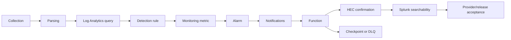

# Splunk Parallel E2E Validation

## Purpose and supported modes

This guide proves Mode 1 raw fan-out, Mode 2 Log Analytics evidence export, or a hybrid policy without merging their evidence. Local tests exercise repository behavior only. Provider acceptance requires a fresh authorized event and authenticated receipts from every enabled layer.

Production Mode 1 must use a pinned, reviewed `oci-splunk` tag or commit and must not track mutable `main`. The migration registry selects immutable commit `a98167404f19be6d18235bccbf1113b59a259c4c`; `2.2.0` identifies bundled Splunk-app provenance, not a Git tag.

## Prerequisites and ownership

Name the test owner, source/system owner, OCI Log Analytics owner, Splunk/HEC owner, network/IAM owner, response owner, and acceptance approver.

### Common prerequisites

- Passing local gates; one safe source/parser/query canary; exact target/profile, region, compartments, UTC window, positive/negative results, approved index/sourcetype, and explicit live approval.
- Reviewed IAM/network, privacy, retention, cost, rollback/replay, evidence-capture, and stop-condition decisions.
- An approved HTTPS HEC input/credential handling path and Splunk Search access. Do not use production raw payloads as fixtures.

### Mode 1 prerequisites

- The exact OCI Logging source scope, dedicated Connector Hub route, OCI Streaming pool/stream/retention, connector policy, and expected raw event.
- Immutable `oci-splunk` commit `a98167404f19be6d18235bccbf1113b59a259c4c`, the chosen consumer, SASL identity/secret handling, runtime/offset owner, and HEC/network capacity.

### Mode 2 prerequisites

- Canonical query, required fields, eligible detection rule, and first Monitoring metric already proven.
- Reviewed disabled alarm and Notifications trigger, approved Function image/digest/subnet/identity, exact Vault secret reference, and checkpoint/DLQ lifecycle.

## Architecture and evidence workflow

Use the editable [validation layers](diagrams/logan-splunk-validation.mmd) and [troubleshooting flow](diagrams/logan-splunk-troubleshooting.mmd).



Mode 1 branches after OCI Logging through its own Connector Hub, Streaming, pinned consumer, HEC, and Splunk-search checks. A Mode 2 HEC receipt does not prove Mode 1 and vice versa.

## IAM and network validation

Render the offline policy review and confirm each applied statement is narrower than or equal to the reviewed target:

```bash
python3 scripts/splunk_evidence_exporter_cli.py render-iam
```

For Mode 1, verify the exact connector identity, log-content read, stream-push/consumer-pull, SASL/TLS endpoints, consumer-host route, and HEC egress. For Mode 2, verify the exact Function dynamic-group match; Log Analytics query/log-group read; exact Vault secret-bundle read; named state/DLQ access; exact Notifications invocation condition; and Function subnet DNS/TLS/HTTPS egress. Do not disable TLS validation or expose an unnecessary ingress path.

## Local scripted validation

Start with the offline contract and configuration:

```bash
python3 scripts/splunk_evidence_exporter_cli.py plan --json
python3 scripts/splunk_evidence_exporter_cli.py validate-config
python3 scripts/splunk_evidence_exporter_cli.py local-e2e --scenario success
```

Expected success output includes `status: delivered`, three query rows/events, one mock HEC attempt, `checkpoint_committed: true`, `evidence_class: locally_verified`, and `provider_validation: not_run`.

Run each fail-closed path:

```bash
python3 scripts/splunk_evidence_exporter_cli.py local-e2e --scenario zero-evidence
python3 scripts/splunk_evidence_exporter_cli.py local-e2e --scenario duplicate-invocation
python3 scripts/splunk_evidence_exporter_cli.py local-e2e --scenario success-after-retry
python3 scripts/splunk_evidence_exporter_cli.py local-e2e --scenario timeout
python3 scripts/splunk_evidence_exporter_cli.py local-e2e --scenario 429
python3 scripts/splunk_evidence_exporter_cli.py local-e2e --scenario 500
python3 scripts/splunk_evidence_exporter_cli.py local-e2e --scenario 400
python3 scripts/splunk_evidence_exporter_cli.py local-e2e --scenario 401
python3 scripts/splunk_evidence_exporter_cli.py local-e2e --scenario oversized-batch
python3 scripts/splunk_evidence_exporter_cli.py local-e2e --scenario missing-secret
python3 scripts/splunk_evidence_exporter_cli.py local-e2e --scenario dlq-write
python3 scripts/splunk_evidence_exporter_cli.py local-e2e --scenario retry-exhaustion
```

Expected output has no checkpoint commit for failed delivery; retryable paths stop at four default attempts and write DLQ; configuration/security failures quarantine after one attempt; zero evidence makes no HEC attempt.

Local replay is separately approved even though it is fixture-only:

```bash
python3 scripts/splunk_evidence_exporter_cli.py local-e2e --scenario approved-replay --approve-replay
```

Expected output reports `EvidenceReplayService`, exactly one original query, preserved quarantined event keys, delivered replay, and checkpoint advance only after confirmation. The command without `--approve-replay` fails closed.

Run the authoritative focused tests:

```bash
python3 -m pytest scripts/test_splunk_detection_registry.py scripts/test_splunk_evidence_exporter.py scripts/test_splunk_evidence_e2e.py scripts/test_splunk_evidence_terraform.py scripts/test_splunk_diagrams.py scripts/test_splunk_documentation.py scripts/test_scan_sensitive_values.py -q
```

The release checklist also runs the focused durable-delivery and telemetry contracts:

```bash
python3 -m pytest scripts/test_splunk_parallel_red_contracts.py -q
```

## Manual provider canary

The offline plan is available with:

```bash
python3 scripts/splunk_evidence_exporter_cli.py canary-plan
```

It does not log in or execute. With separate live approval:

1. **Collection:** in OCI Console **Log Analytics → Log Explorer**, find one fresh approved event by exact source/entity/window. Record count and time without raw sensitive content.
2. **Parsing:** display the required fields from the registry and confirm values/types. A raw row without fields fails this gate.
3. **Log Analytics query:** run the canonical query; prove the canary hit and negative control.
4. **Detection rule:** in **Administration → Detection Rules**, verify the scheduled execution completed.
5. **Monitoring metric:** use the rule's **Metrics** tab/Metrics Explorer to capture namespace, metric name, value, and bounded dimensions.
6. **Alarm:** verify the disabled definition, then enable only the reviewed canary action and capture one transition.
7. **Notifications:** verify the exact topic/subscription delivered to the exact Function.
8. **Function:** inspect service logs for a sanitized success/failure summary and bounded query counts. No token, raw payload, OCID, IP, hostname, or customer topology belongs in published evidence.
9. **Checkpoint/DLQ:** on success, verify the checkpoint object/version is later than the prior value and follows HEC confirmation. On failure, verify DLQ creation and no checkpoint advance.
10. **HEC confirmation:** capture sanitized response status or confirmed indexer acknowledgment according to configured mode.
11. **Splunk searchability:** in Splunk Web open **Search & Reporting**, set the same UTC window, and run `index=<REVIEWED_INDEX> sourcetype=oci:logan:detection schema_version="oci.logan.splunk.evidence.v1"`. Confirm detection ID, batch ID, and stable event key; do not publish target values.
12. **Provider acceptance:** disable or promote the canary and have owners accept lag, failures, cost, retention, privacy, replay, and rollback.

For Mode 1, additionally verify the source connector success, stream messages/retention, pinned consumer version/health/offset, HEC transport receipt, and the same fresh event searchable in both Log Analytics and Splunk raw index. Do not reuse a Mode 2 evidence row as raw-path proof.

## Script-assisted provider path

Repository CLI previews/validators and deterministic context staging are offline. `terraform init` may contact provider registries; `terraform plan` loads configured credentials and may read OCI or configured state. Neither phase mutates infrastructure, but neither phase is offline or credential-free. Follow the ordered approval flow in [the export runbook](SPLUNK_EVIDENCE_EXPORT_RUNBOOK.md): offline CLI preflight/staging, build approval, dependency initialization, provider read/plan, apply approval, canary approval, and replay approval. There is no command here that performs a live canary or live replay.

## Failure modes and troubleshooting

| Observation | Stop at | Action |
|---|---|---|
| No fresh record | Collection | Fix source/entity/agent/connector and time window |
| Record but missing field | Parsing | Correct source/parser association |
| Fields but no query hit | Query | Compare semantics, threshold, UTC window, late arrival |
| Query hit but no metric | Detection rule | Check eligibility, schedule, aggregate alias, dimensions |
| Metric but no alarm | Alarm | Check namespace/query/window and disabled state |
| Alarm but no invocation | Notifications | Check topic, subscription, invocation IAM |
| Function fails before HEC | Function/network/Vault | Check sanitized logs, route/DNS/TLS, exact secret access |
| HEC 429/5xx/timeout | Delivery | Allow bounded retry; check DLQ/no checkpoint |
| HEC 4xx | Configuration/security | Quarantine; correct endpoint/token/index/payload |
| HEC confirms but no search | Splunk searchability | Check time/index/sourcetype/indexing delay and ack mode |

## Cost, retention, privacy, and cardinality

Record canary and projected steady-state volume for Log Analytics ingest/query/storage, Streaming/raw duplication, Functions, Notifications, Vault, Object Storage, Logging, egress, HEC, and Splunk license/index retention. Test close to realistic rates without sending sensitive data. Keep original content excluded by default and published receipts sanitized.

Metric dimensions are limited to no more than three governed fields; event evidence can still be high-cardinality. Track duplicate-key rate, HEC batch count, DLQ growth, query rows, and source/detection frequency. Retention in Log Analytics, stream, state/DLQ, Function logs, and Splunk are independent approvals.

Occurrence identity is derived from the detection ID plus the governed source row, including source event time and `FirstSeen`/`LastSeen` bounds. Moving query-window metadata is excluded, so overlapping alarms and retries produce the same key; two source occurrences with equal aggregate values but different event-time bounds remain distinct. During a partial batch failure, the exporter emits both the confirmed `DeliveredEvents` count and the `DeadLetteredEvents` count so the metric record reconciles with the sanitized receipt and DLQ.

## Rollback, cleanup, and replay

On any stop condition, disable the alarm action and exact Function subscription first; for Mode 1 stop the consumer or disable only the Streaming connector. Preserve Log Analytics collection. Capture checkpoint/DLQ/consumer offsets before changing state.

Do not delete canary evidence until reconciliation and retention acceptance. Cleanup of Terraform-created resources needs a reviewed destructive plan and must preserve reused networks, Vault secrets, buckets, topics, and Splunk resources. Review live replay offline with `replay-plan`; live replay is manual/externally orchestrated, target-bound, at-least-once, and must preserve stable keys and defer checkpoint advance until HEC confirmation.

## Evidence class and limitations

Schemas/tests/diagrams are **code-backed**. The deterministic harness is **locally verified**. Provider resources may be **configured** without working end to end. Each live layer is **provider verified** only by its own authenticated receipt, and **release accepted** only after named owner acceptance. An HTTP 200/HEC response is not Splunk searchability; a Splunk result is not proof of all upstream layers. This guide performs no live work.

## Oracle sources

- [Log Analytics ingestion troubleshooting](https://docs.oracle.com/en-us/iaas/log-analytics/doc/troubleshoot-ingestion-pipeline.html)
- [Manage detection rules](https://docs.oracle.com/en-us/iaas/log-analytics/doc/manage-detection-rules.html)
- [Create a Function subscription](https://docs.oracle.com/en-us/iaas/Content/Notification/Tasks/create-subscription-function.htm)
- [Access OCI resources from Functions](https://docs.oracle.com/en-us/iaas/Content/Functions/Tasks/functionsaccessingociresources.htm)
- [Manage Log Analytics storage](https://docs.oracle.com/en-us/iaas/log-analytics/doc/manage-storage.html)
- [Splunk Search app](https://help.splunk.com/en/splunk-enterprise/search/search-manual/10.4/use-the-search-app/about-the-search-app)
