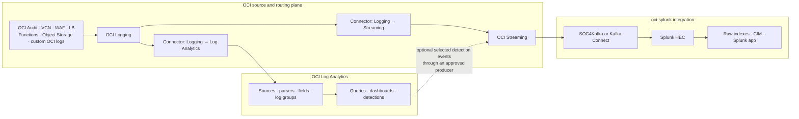
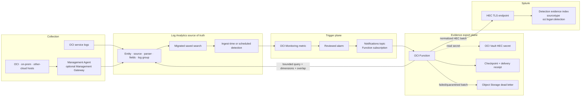
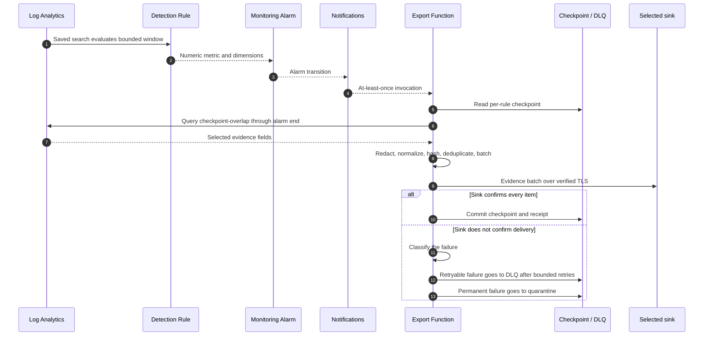
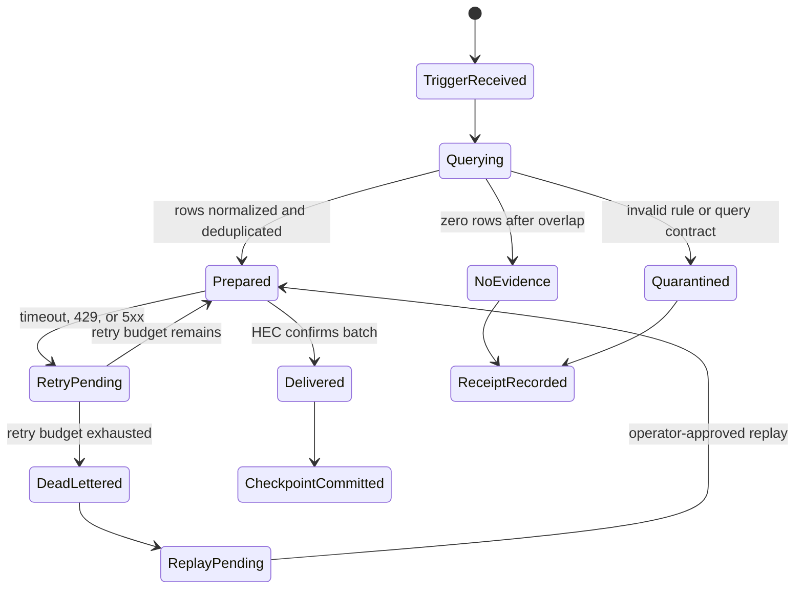

# OCI Log Analytics and Splunk Parallel Operations Design

Date: 2026-09-02
Status: approved for implementation
Evidence class: design, backed by repository inspection and current public documentation

## Goal

Support Splunk alongside OCI Log Analytics through two explicit delivery modes:

1. **Raw parallel fan-out:** OCI Logging sends approved raw sources both to OCI Log Analytics and, through OCI Streaming, to Splunk using [`adibirzu/oci-splunk`](https://github.com/adibirzu/oci-splunk).
2. **Log Analytics source of truth:** OCI and on-premises logs are collected and processed in Log Analytics. High-value Splunk detections are recreated as governed LAQL saved searches and detection rules. Detection metrics trigger a bounded evidence exporter that queries the matching Log Analytics records and sends an enriched event envelope to Splunk HEC.

Both modes may be enabled at the same time on a per-source and per-detection basis. The design keeps raw-event duplication, derived detection evidence, credentials, replay, cost, and acceptance independently visible.

## Product behavior that shapes the design

- Log Analytics ingest-time and scheduled detection rules post metrics to OCI Monitoring. They do not directly forward matching log records.
- A Monitoring alarm can publish to OCI Notifications, and a Notifications function subscription can invoke OCI Functions.
- Connector Hub supports OCI Logging as a source with both Log Analytics and Streaming targets. Separate connectors provide the two raw destinations.
- Log Analytics query results can be retrieved through the SDK/CLI. The service is optimized for analysis rather than continuous bulk export, so Option 2 must query a bounded detection window and selected fields rather than operate as an unrestricted raw-log pump.
- The public `oci-splunk` project currently owns the OCI Streaming to Splunk HEC transport, managed/existing Splunk modes, SOC4Kafka or legacy Kafka Connect consumers, a Splunk app, and transport verification.

Authoritative references:

- [Manage Log Analytics Detection Rules](https://docs.oracle.com/en-us/iaas/log-analytics/doc/manage-detection-rules.html)
- [Create a Function Subscription](https://docs.oracle.com/en-us/iaas/Content/Notification/Tasks/create-subscription-function.htm)
- [Connector Hub Overview and Supported Routes](https://docs.oracle.com/en-us/iaas/Content/connector-hub/overview.htm)
- [Log Analytics Query IAM Permissions](https://docs.oracle.com/en-us/iaas/Content/Identity/policyreference/loganalyticspolicyreference.htm)
- [Access OCI Resources from Functions](https://docs.oracle.com/en-us/iaas/Content/Functions/Tasks/functionsaccessingociresources.htm)
- [Export Logs](https://docs.oracle.com/en-us/iaas/log-analytics/doc/export-logs.html)
- [`adibirzu/oci-splunk`](https://github.com/adibirzu/oci-splunk)

## Architecture decisions

### AD-1: Log Analytics remains the canonical analytics plane

Every supported OCI, host, application, and custom source selected for this program must land in Log Analytics with a verified source, parser, field, entity, log-group, retention, and ownership contract. Splunk can retain raw or derived copies, but it is not the source of truth for this repository's query and detection state.

### AD-2: Raw delivery and evidence delivery are separate products

Raw delivery is a source-routing decision handled by OCI Logging, Connector Hub, OCI Streaming, and `oci-splunk`. Evidence delivery is a detection-response decision handled by Log Analytics, Monitoring, Notifications, an export Function, and Splunk HEC.

The implementation must never label a detection rule as a log forwarder.

### AD-3: Reuse existing canonical query surfaces

Do not introduce a parallel `queries/splunk/` directory.

- Prefer portable Sigma/YAML under `rules/**` when a Splunk analytic describes a portable event pattern.
- Use `queries/hunting/**` for curated aggregation, correlation, or SPL-specific semantics that cannot be represented faithfully in Sigma.
- Use existing `scripts/ql/splunk.py` conversion behavior for analysis and operator assistance, not automatic promotion.
- Add a generated Splunk migration/delivery registry that references canonical query files and records SPL provenance, translation status, required sources/fields, detection-rule eligibility, delivery mode, and validation evidence.

### AD-4: Production deployments pin the Splunk integration

Documentation may link to the `oci-splunk` main branch for discovery. Resource Manager and production procedures must use a reviewed tag or commit rather than silently tracking mutable `main`.

### AD-5: Option 2 is at-least-once and replayable at the selected sink

Alarm and Notifications delivery can repeat. The exporter must tolerate duplicates and must not advance its query checkpoint before the selected durable sink confirms every item in the batch. For direct HEC, confirmation means the configured HEC response or indexer acknowledgment. For Streaming, confirmation means a zero-failure `PutMessages` response containing one successful result per submitted item; consumer offset, downstream HEC, and Splunk-search receipts remain separate gates owned by the pinned `oci-splunk` consumer. A downstream failure must be recovered from the retained Stream and consumer offset, not by pretending the producer checkpoint proves Splunk acceptance.

Each exported row receives a deterministic event key derived from:

```text
rule_id + normalized_event_time + log_source + entity_identity + stable_row_hash
```

Splunk events carry both this key and an export batch ID. Splunk-side searches may deduplicate on the event key while retaining transport diagnostics.

## Architecture diagrams

### Mode 1: raw parallel fan-out



Operational implications:

- Add approved OCI log objects to both Connector Hub source selections.
- Enable connector service logs and monitor connector/stream lag and errors.
- Prove the same canary event in Log Analytics and Splunk before adding another source.
- Track duplicate ingestion, retention, egress, and Splunk license cost explicitly.
- On-premises Management Agent records do not automatically appear in OCI Logging and therefore do not enter this raw fan-out unless a separate approved raw route is configured.
- The dashed Log Analytics detection-to-Streaming link uses the exporter Function's optional Streaming adapter; Log Analytics does not automatically publish detection rows to OCI Streaming. The Function sends the same normalized envelope and event key either directly to HEC or to an exact reviewed Stream for the pinned `oci-splunk` consumer. Validate Stream IAM, retry/DLQ behavior, consumer compatibility, HEC delivery, and Splunk searchability independently before enabling this sink.

### Mode 2: Log Analytics detection evidence export



## Component responsibilities

### This repository

- Prioritized Splunk detection registry and SPL provenance.
- Canonical LAQL queries, dashboard wiring, and detection-rule specifications.
- Evidence envelope schema and examples.
- Export Function source and locally runnable core library.
- Terraform/Resource Manager module for the evidence exporter.
- Variable-safe IAM policy templates and preflight report.
- Synthetic source, alarm, Log Analytics result, and HEC fixtures.
- Unit, contract, local E2E, dry-run, and live-canary procedures.
- README, documentation hub, migration, onboarding, deployment, operations, troubleshooting, cleanup, and evidence documentation.
- Mermaid and Excalidraw source files for each workflow.

### `adibirzu/oci-splunk`

- Mode 1 Logging to Streaming path.
- Stream pool/stream and consumer configuration.
- SOC4Kafka or legacy Kafka Connect execution.
- Managed Splunk or existing Splunk HEC configuration.
- Splunk app, raw indexes, CIM mappings, dashboards, saved searches, and transport tests.
- Splunk-side installation and lifecycle documentation.

This repository links to `oci-splunk`; it does not copy its Terraform, consumer templates, HEC credentials, or Splunk application.

### Customer/operator

- Exact OCI profile, tenancy, region, compartment, namespace, log groups, log sources, and entities.
- Raw-versus-derived delivery policy per source and detection.
- Retention, volume, privacy, compliance, and cost decisions.
- Splunk deployment, HEC endpoint, index, sourcetype, and token ownership.
- VCN/subnet routing, NAT or private connectivity, DNS, TLS trust, NSGs, and firewall policy.
- Alarm thresholds, topic subscriptions, approved canaries, and response ownership.
- Live validation authorization, rollback, cleanup, and release acceptance.

## Splunk rule migration process

### Initial priority set

Start with the enabled high-value alerts already supplied by the `oci-splunk` application:

1. VCN rejected-traffic spike;
2. OCI Audit failures;
3. IAM or policy changes; and
4. new external source IP to Object Storage.

Then add the five current Windows access analytics:

1. more than ten failed logons from one source in five minutes;
2. successful RDP outside business hours;
3. Administrator logon;
4. new local user; and
5. user added to Administrators or Remote Desktop Users.

Further rules are selected from the generated cross-SIEM catalog in quality-first order rather than by copying every Splunk search.

### Migration record

Every migrated analytic must include:

- stable migration ID;
- title and security objective;
- Splunk repository/app/version and saved-search provenance;
- original SPL or a source link when licensing prevents redistribution;
- canonical OCI query file;
- source and field requirements;
- semantic fidelity: lossless, transformed, or unsupported;
- detection mechanism: ingest-time, scheduled, or interactive only;
- metric name and no more than three dimensions when scheduled;
- Mode 1 raw delivery and Mode 2 evidence-delivery policy;
- Splunk target index/sourcetype placeholders;
- expected results, false positives, tuning, and cost/cardinality notes;
- local, parser, data-hit, dashboard-render, metric, HEC, and Splunk-search evidence states.

### Promotion gates

1. Verify the source and display fields against the generated dictionary.
2. Convert or author the canonical LAQL query.
3. Validate syntax and scheduled-search restrictions.
4. Prove deterministic synthetic matches and nonmatches.
5. Validate dashboard visualization compatibility when applicable.
6. Validate the query against representative live data after approval.
7. Create the saved search.
8. Create the detection rule and verify its first Monitoring metric.
9. Create the alarm disabled.
10. Run one approved evidence-export canary.
11. Verify the event in the intended Splunk index and sourcetype.
12. Record customer acceptance before broader enablement.

## Evidence export contract

The HEC payload must be versioned and contain no OCI credentials or raw alarm payload secrets.

Required logical fields:

```json
{
  "schema_version": "oci.logan.splunk.evidence.v1",
  "event_key": "<DETERMINISTIC_HASH>",
  "batch_id": "<EXPORT_BATCH_ID>",
  "detection": {
    "id": "<RULE_ID>",
    "title": "<RULE_TITLE>",
    "severity": "<SEVERITY>",
    "metric_namespace": "<METRIC_NAMESPACE>",
    "dimensions": {}
  },
  "evidence": {
    "include_original_content": false,
    "event_time": "<RFC3339>",
    "log_source": "<LOG_SOURCE>",
    "entity": null,
    "fields": []
  },
  "provenance": {
    "product": "OCI Log Analytics",
    "analytics_plane": "oci_log_analytics",
    "query_file": "queries/hunting/<QUERY_FILE>.json",
    "query_version": "<QUERY_VERSION>",
    "window_start": "<RFC3339>",
    "window_end": "<RFC3339>"
  }
}
```

Default policy excludes `Original Log Content`. A rule may include a bounded, redacted subset only after privacy, licensing, and incident-response review.

## Export sequence and state model



State transitions:



## IAM and security boundaries

Exact policy statements will be generated as variable-safe templates and must be narrowed to the reviewed compartments/resources.

### Human/operator permissions

- inspect/read the relevant OCI Logging log groups and logs;
- inspect/use the intended Log Analytics sources, fields, entities, queries, log groups, and scheduled tasks;
- manage only the selected dashboard, detection, Monitoring alarm, Notifications topic, Function application/function, Vault secret, and DLQ resources required by the deployment path;
- manage Connector Hub and Streaming only when enabling Mode 1.

### Service and resource-principal permissions

- Connector Hub reads the selected OCI logs and writes to the exact Log Analytics log group or Streaming target.
- The Function resource principal reads Log Analytics query results and the required log-group/lifecycle/query-job resources.
- The Function reads the exact Vault secret bundle containing the HEC token and uses the key only when the secret uses a customer-managed key.
- The Function writes only to its checkpoint/DLQ bucket or dedicated state store and publishes only its operational metrics/logs.
- Notifications receives permission to invoke the exact Function subscription target.

### Secret and network controls

- Never store a HEC token in Git, Terraform state output, Function config, logs, alarm payloads, or generated evidence.
- Retrieve the token at runtime from Vault and cache it only in memory for the invocation.
- Verify the Splunk HEC certificate and hostname. Custom certificate authorities require an explicitly maintained trust bundle.
- Use a private route over FastConnect/VPN when Splunk is privately reachable; otherwise use reviewed NAT/egress with destination controls where available.
- Deny broad inbound access to the Function. The trigger is the Notifications function subscription.
- Redact customer topology and stable tenancy identifiers from committed fixtures and published receipts.

## Supported use cases

| Use case | Collection | Log Analytics role | Splunk delivery | Acceptance |
|---|---|---|---|---|
| All approved OCI raw logs | OCI Logging | Full parsing, hunting, dashboards, detections | Parallel Connector Hub → Streaming → `oci-splunk` | Same canary event queryable in both systems |
| High-value OCI detections | OCI Logging → Log Analytics | Primary correlation and detection | Versioned evidence envelope through exporter | Metric, alarm, evidence rows, HEC receipt, Splunk result |
| On-premises Windows | Management Agent, optionally Management Gateway | Native Security/System/Application processing | Selected evidence through exporter | Fresh approved event crosses every layer |
| On-premises Linux/custom files | Management Agent source association | Parser and field normalization | Selected evidence through exporter | Source-specific positive and negative fixtures plus canary |
| Compliance raw plus SOC signal | Per-source hybrid | Canonical OCI search and tuning | Raw mandatory sources plus derived detections | Duplicate paths labeled; retention and cost accepted |
| Splunk outage | Collection continues into Log Analytics | Source of truth remains searchable | Retry and DLQ; controlled replay | No checkpoint advance before HEC confirmation |
| Log Analytics query/detection failure | Source ingestion remains observable | Error is visible and alert remains disabled | No empty/synthetic success forwarded | Query, rule, metric, and export gates fail closed |
| HEC credential rotation | Collection/detection unaffected | No credential stored in content | Vault version refresh and canary | Old secret rejected, new secret confirmed, no token logged |

## On-premises Management Agent workflow

1. Record the authorized host, owner, maintenance window, source files/channels, expected volume, proxy/gateway, and stop conditions.
2. Complete the documented Management Agent prerequisites and outbound connectivity checks.
3. Install or enable the agent using the existing guarded PowerShell/manual process.
4. Create or verify the correct entity and associate native or custom sources.
5. Prove fresh rows and required display fields in Log Analytics.
6. Validate the migrated saved search against the source.
7. Create the detection rule and prove the first Monitoring metric.
8. Create the alarm disabled and attach the exporter topic only after metric proof.
9. Enable one approved canary, verify the HEC event and Splunk search, then disable or promote according to the change plan.
10. Record lag, failures, volume, privacy, cost, rollback, and operator handoff.

## Failure behavior

| Failure | Required behavior |
|---|---|
| Missing source rows | Stop at collection troubleshooting; do not create a success receipt |
| Detection metric absent | Keep alarm/export disabled; inspect scheduled-query limits and late arrival |
| Duplicate alarm invocation | Re-query with overlap and suppress already delivered event keys |
| Log Analytics query throttled/timed out | Retry within a bounded budget; do not widen unboundedly |
| HEC timeout, 429, or 5xx | Exponential backoff with jitter, then DLQ without checkpoint advance |
| HEC 400/401/403 | Quarantine as configuration/security failure; do not retry indefinitely |
| Vault secret unavailable | Fail closed and emit sanitized operational telemetry |
| DLQ/state unavailable | Fail closed before calling HEC unless an idempotent stateless retry is provably safe |
| Payload too large | Split deterministically below configured HEC limits; preserve batch lineage |
| Unsupported SPL semantic | Mark unsupported; do not publish an approximate detection as equivalent |

## Repository implementation shape

The implementation will add or update these surfaces:

### Documentation

- `README.md`: link and concise two-mode architecture.
- `docs/README.md`: operator navigation for raw fan-out, evidence export, on-prem collection, migration, E2E, and troubleshooting.
- `docs/ARCHITECTURE.md`: multi-SIEM boundaries and diagrams.
- `docs/MIGRATION_AND_SECURITY_GUIDE.md`: Splunk-specific raw-versus-derived decision process.
- `docs/FAST_ONBOARDING_TRACK.md`: Splunk selection and on-prem Management Agent branch.
- `docs/DEPLOYMENT.md`: prerequisites, policies, staged deployment, rollback, and cleanup.
- `docs/SPLUNK_PARALLEL_OPERATIONS.md`: complete use-case and operating guide.
- `docs/SPLUNK_RULE_MIGRATION.md`: rule intake, fidelity, promotion, and tuning.
- `docs/SPLUNK_EVIDENCE_EXPORT_RUNBOOK.md`: manual and scripted deployment/operations.
- `docs/SPLUNK_E2E_VALIDATION.md`: local, OCI, Splunk, failure, replay, and evidence tests.

### Canonical configuration and schemas

- `config/splunk_parallel_delivery.yaml`: source/detection delivery policy with placeholders only.
- `schemas/splunk_detection_registry.schema.json`: migration registry contract.
- `schemas/splunk_evidence_event.schema.json`: HEC evidence contract.
- generated `queries/splunk_detection_registry.json`: canonical mapping from Splunk provenance to repository query/detection/export metadata.

### Implementation

- `scripts/generate_splunk_detection_registry.py`: deterministic registry generator and drift check.
- `scripts/splunk_evidence_exporter/`: pure core plus OCI and HEC adapters.
- `scripts/splunk_evidence_exporter_cli.py`: offline plan, fixture execution, payload rendering, and approved canary entry point.
- `stack/modules/splunk_evidence_exporter/`: optional Terraform module for Function, Vault reference, topic/subscription, alarm wiring, state/DLQ, logging, and metrics.
- `scripts/release_checklist.py`: local contracts and drift checks only; no live invocation.

### Diagrams

Each view will have Mermaid plus editable Excalidraw source:

1. two-mode logical architecture;
2. raw OCI fan-out topology;
3. Log Analytics evidence export topology;
4. on-premises Management Agent path;
5. saved-search-to-Splunk sequence;
6. retry, checkpoint, DLQ, and replay state machine;
7. IAM/trust boundaries;
8. manual versus scripted onboarding;
9. E2E validation and evidence progression; and
10. troubleshooting decision tree.

Diagram source must remain tenant-neutral and pass the OCI diagram validator. PNG renderings are optional views, not canonical source.

## Implementation phases

### Phase 1: contracts and documentation

- Add schemas, configuration shape, generated registry contract, documentation, and diagrams.
- Link and accurately describe `oci-splunk` without copying its implementation.
- Add documentation link/fence/count and sensitive-value tests.

### Phase 2: rule migration baseline

- Register the four `oci-splunk` alerts and five Windows access rules.
- Reuse or add canonical Sigma/hunting queries.
- Generate detection-rule specs and synthetic positive/negative fixtures.
- Keep unsupported or lossy SPL semantics explicit.

### Phase 3: exporter core and local E2E

- Implement alarm decoding, registry lookup, bounded-window calculation, query adapter, envelope normalization, redaction, hashing, batching, HEC adapter, checkpoints, retry classification, DLQ, and receipts.
- Run a local fake Log Analytics adapter and mock HEC server through success, duplicate, empty, timeout, 429, 5xx, 4xx, invalid schema, missing secret, DLQ, and replay cases.

### Phase 4: optional OCI deployment module

- Render a plan using placeholders and safe defaults.
- Default alarms and Function subscription enablement to disabled.
- Require an existing Vault secret reference; never create or output the HEC secret value.
- Provide least-privilege policy templates and read-only prerequisite checks.

### Phase 5: approved live canary

- Resolve the exact tenancy, region, compartments, namespace, log group, Function, topic, Vault secret, HEC endpoint, index, source, rule, owner, cost, and stop conditions.
- Prove one safe event through collection, Log Analytics query, detection metric, alarm, Function, HEC, and Splunk search.
- Exercise one controlled retry/DLQ scenario only when separately approved.
- Sanitize receipts and obtain operator acceptance before broader rollout.

## Test and acceptance strategy

### Local tests

- Schema validation for configuration, registry, and evidence envelopes.
- Deterministic registry generation and drift detection.
- SPL provenance and semantic-fidelity checks.
- Source/field dictionary validation for every migrated query.
- Positive and negative query fixtures.
- Scheduled-search restrictions, numeric metric shape, and dimension cardinality.
- Alarm payload decoding for representative OCI alarm messages.
- Deterministic event keys and duplicate suppression.
- Checkpoint overlap and commit-after-HEC semantics.
- HEC batching, TLS settings, secret redaction, and retry classification.
- Mock E2E success, no evidence, duplicates, timeout, 429, 5xx, 4xx, DLQ, and replay.
- Terraform format/validate and policy-template placeholder checks.
- Mermaid/Excalidraw structural validation, Markdown links/fences, and secret scan.
- Existing repository full test and release-checklist gates.

### Provider canary acceptance

The canary is provider verified only when all of these are recorded:

1. fresh authorized source record in Log Analytics;
2. required parsed fields present;
3. saved search returns the intended evidence and its negative control does not;
4. detection rule posts the expected Monitoring metric;
5. disabled alarm is reviewed and one canary transition is enabled;
6. Notifications invokes the intended Function;
7. Function receipt records the bounded query and confirmed HEC batch without secrets;
8. event is queryable in the intended Splunk index/sourcetype with the expected event key;
9. connector/function/export lag and error metrics are healthy;
10. owner accepts rollback, replay, retention, cost, and operating procedures.

Local tests, a Terraform plan, an active connector, a successful Function invocation, or an HEC HTTP response alone cannot close this gate.

## Backward compatibility and rollout

- Existing Log Analytics query, dashboard, Windows onboarding, Forge, and multicloud contracts remain unchanged.
- Existing `oci-splunk` raw delivery remains independently deployable.
- Mode 2 is additive and disabled by default.
- No existing alarm is repointed automatically.
- No HEC token is migrated automatically.
- Delivery policy is opt-in per rule/source and can be rolled back by disabling the alarm/subscription while collection and Log Analytics analysis continue.
- Removal of the exporter must preserve Log Analytics data and must not destroy reused topics, Vault secrets, networks, buckets, or Splunk resources.

## Documentation quality bar

Every operator page must include:

- purpose and supported mode;
- prerequisites and exact ownership boundary;
- component diagram and sequence/workflow;
- variable-safe IAM and network requirements;
- manual steps and script-assisted equivalent;
- validation after every layer;
- expected output and failure modes;
- cost, retention, privacy, and cardinality implications;
- rollback, cleanup, and replay;
- evidence classification and limitations;
- links to current Oracle documentation and the pinned/selected `oci-splunk` version.

## Design self-review

- No placeholder design decisions remain: both modes are supported, Mode 2 is recommended for derived evidence, and raw exceptions are policy-driven.
- Query ownership stays within existing canonical surfaces.
- Detection metrics and evidence forwarding are explicitly separated.
- At-least-once delivery, duplicate suppression, checkpoint commit, DLQ, and replay semantics are defined.
- On-premises Management Agent collection is included.
- `oci-splunk` is linked and reused without duplicating its implementation.
- Local and provider E2E evidence classes remain separate.
- Live, credential, IAM-expanding, expensive, and destructive operations remain approval-gated.
