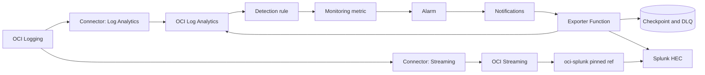

# Splunk Parallel Operations

## Purpose and supported modes

This is the operating guide for running Splunk beside OCI Log Analytics without confusing raw transport with detection evidence. Log Analytics remains the source of truth for this repository's parsers, LAQL, dashboards, and detection rules.

- **Mode 1 — raw OCI fan-out:** selected OCI Logging records go through a dedicated Service Connector Hub connector to OCI Streaming and then through `adibirzu/oci-splunk` to Splunk HEC.
- **Mode 2 — Log Analytics evidence export:** a Log Analytics detection rule posts a Monitoring metric; an alarm publishes to Notifications; a Function runs the bounded canonical Log Analytics query and sends versioned evidence to Splunk HEC.
- **Hybrid:** choose either or both modes per source and per detection. Do not assume that enabling one mode enables the other.

The full architecture sources are [Mermaid](diagrams/logan-splunk-architecture.mmd) and [Excalidraw](diagrams/logan-splunk-architecture.excalidraw). Use the [evidence-export runbook](SPLUNK_EVIDENCE_EXPORT_RUNBOOK.md), [rule-migration guide](SPLUNK_RULE_MIGRATION.md), and [E2E validation guide](SPLUNK_E2E_VALIDATION.md) for detailed changes and receipts.

## Decision matrix

| Requirement | Mode 1 raw | Mode 2 evidence | Hybrid |
|---|---|---|---|
| Full approved raw record in Splunk | Yes | No; selected fields only | Per source |
| Log Analytics is canonical query/detection plane | Yes | Yes | Yes |
| Duplicate ingestion and license cost | Expected | Reduced | Explicitly budgeted |
| OCI/on-prem source | OCI Logging sources | Any source already parsed in Log Analytics | Per source |
| Primary recovery boundary | Streaming/consumer offsets | Checkpoint, stable `event_key`, DLQ | Both |
| Acceptance | Same fresh record searchable in both systems | Metric through Splunk searchability | Each enabled path independently |

Use Mode 1 only for a source whose raw-copy, retention, privacy, and Splunk-license requirements are approved. Use Mode 2 for governed, bounded detection evidence. A compliance source may use Mode 1 while a high-cardinality host source uses Mode 2.

## Prerequisites and ownership

Before any provider action, record the OCI profile/account, region, tenancy, exact compartments, Log Analytics namespace/log groups/sources/entities, Splunk deployment and index owner, HEC owner, network owner, change window, authorized canary, stop conditions, rollback owner, retention, and cost approver.

| Owner | Responsibility |
|---|---|
| Telemetry owner | Source approval, parser, fields, volume, privacy, and retention |
| Log Analytics owner | Collection, saved search, detection rule, and metric proof |
| OCI platform owner | Connector/Streaming or Function/Notifications/Vault/state resources |
| Network owner | DNS, TLS trust, subnet route, NSG/firewall, NAT or private route |
| Splunk owner | HEC endpoint/token, allowed index, sourcetype, search, license, retention |
| SOC/change owner | Alarm enablement, canary, replay, incident handling, acceptance |

Prerequisites are a parsed fresh-event proof in Log Analytics; the required source/display fields; a reviewed delivery policy in [`config/splunk_parallel_delivery.yaml`](../config/splunk_parallel_delivery.yaml); an HTTPS HEC JSON-event endpoint; an existing Vault secret for the HEC credential; existing Function subnets; and explicit live approval. The repository commands do not authenticate to OCI or Splunk.

## Architecture and workflow



Collection, parsing, Log Analytics query results, detection-rule execution, Monitoring metric, alarm transition, Notifications delivery, Function invocation, HEC confirmation, checkpoint commit, Splunk searchability, and provider acceptance are separate evidence layers. `RUNNING`, HTTP success, or a rendered page cannot stand in for later layers.

## IAM and network requirements

Run this offline preview and have an OCI IAM reviewer replace every placeholder:

```bash
/Users/abirzu/oci-cli/bin/python3 scripts/splunk_evidence_exporter_cli.py render-iam
```

It renders eight review categories and never applies policy. Mode 1 requires one exact Service Connector principal to read the approved log content and push to the exact stream. Mode 2 uses a dynamic group matching the exact Function OCID and separately scoped grants for Log Analytics queries, the exact Vault secret bundle, the named checkpoint/DLQ buckets, and Notifications invocation of the exact Function. Operator convenience grants such as `functions-family` and `ons-family`, and the Object Storage lifecycle service grant, are broader than a single resource; review and split duties where the tenancy model permits.

The Function accepts only an HTTPS authority ending in `/services/collector/event`; userinfo, query strings, fragments, and embedded credentials are rejected. Provide outbound DNS/TLS and either a private FastConnect/VPN route to Splunk or reviewed NAT egress with NSG/firewall destination controls. The module creates no VCN or subnet and needs no inbound route: Notifications invokes the Function. Maintain an explicit trust bundle for a private CA; never bypass certificate validation.

Oracle IAM references: [Log Analytics policy reference](https://docs.oracle.com/en-us/iaas/Content/Identity/policyreference/loganalyticspolicyreference.htm), [Functions resource principals](https://docs.oracle.com/en-us/iaas/Content/Functions/Tasks/functionsaccessingociresources.htm), and [Function/network policies](https://docs.oracle.com/en-us/iaas/Content/Functions/Tasks/functionscreatingpolicies.htm).

## Mode 1 manual procedure: raw fan-out

Production must use a reviewed tag or commit of `adibirzu/oci-splunk`; it must not track mutable `main`. The current reviewed provenance used by this repository is tag `2.2.0` at commit `a98167404f19be6d18235bccbf1113b59a259c4c`. [Browse the project](https://github.com/adibirzu/oci-splunk) for discovery, but use the [pinned tree](https://github.com/adibirzu/oci-splunk/tree/a98167404f19be6d18235bccbf1113b59a259c4c) for production review.

1. In OCI Console, open **Observability & Management → Logging → Logs**, select one approved source, and record its log group and expected event.
2. Open **Analytics & AI → Messaging → Streams**, create or select the reviewed stream and verify retention, partitions, encryption, and consumer ownership.
3. Open **Analytics & AI → Connector Hub**, create a connector with **Logging** as source and **Streaming** as target. Select only the approved log compartment/group/log and exact stream. Keep the existing Log Analytics connector unchanged.
4. Apply the exact connector-principal policies from the reviewed `render-iam` output. Do not reuse the Function dynamic group.
5. Deploy the pinned `oci-splunk` release using its reviewed managed-Splunk or existing-HEC path and selected `soc4kafka` or `legacy_kafka_connect` consumer. This repository does not copy or operate that transport.
6. In Splunk Web, verify the HEC input, token state, allowed index, sourcetype, and TLS settings under **Settings → Data Inputs → HTTP Event Collector**. Store the token only in the approved secret system.
7. Generate one fresh approved OCI canary. Confirm the same immutable event attribute and time window in Log Analytics and **Search & Reporting** in Splunk.

Expected output is one fresh, parsed Log Analytics record and one searchable raw Splunk event, plus connector, stream-consumer, and HEC transport receipts. A connector `ACTIVE` state alone is not acceptance.

The script-assisted equivalent is owned by the pinned `oci-splunk` release. Begin its documented offline Terraform/Resource Manager preview, review the saved plan and exact source/stream/HEC boundaries, then obtain a separate apply approval. Do not run its mutable `main` branch in production.

## Mode 2 manual procedure: evidence export

1. In **Observability & Management → Log Analytics → Log Explorer**, run the registry's canonical `oci_query_file` over a bounded window. Verify required sources and fields and save the search.
2. In **Log Analytics → Administration → Detection Rules**, create the scheduled rule from the saved search. Keep the alarm absent or disabled until the first expected metric appears.
3. In the detection-rule details **Metrics** tab or **Monitoring → Metrics Explorer**, verify the actual namespace, metric name, and no more than three bounded dimensions from [`queries/detection_rule_specs.json`](../queries/detection_rule_specs.json).
4. In **Developer Services → Functions**, create the application in reviewed existing subnets, deploy the reviewed digest-pinned image, and set the rendered configuration. Put only the Vault secret OCID in `SPLUNK_HEC_SECRET_ID`; never put the token in Function config.
5. Create or select private versioned Object Storage buckets for checkpoint and DLQ. Confirm lifecycle: 30 days for superseded checkpoint versions, 90 days for current DLQ objects, and 30 days for superseded DLQ versions when using module defaults.
6. In **Developer Services → Application Integration → Notifications**, create the evidence topic. Add a **Function** subscription only after the exact function-invocation policy is approved.
7. In **Monitoring → Alarm Definitions**, create the detection alarm disabled and select the evidence topic as destination. The module's separate Function-error alarm is disabled by default.
8. In Splunk Web, create or select the approved index and HEC input with sourcetype `oci:logan:detection`. Choose `response` semantics or enable indexer acknowledgment and configure `indexer_ack` consistently.
9. During the approved canary window, enable only the reviewed alarm/subscription path, generate one safe event, and validate every layer in the [E2E guide](SPLUNK_E2E_VALIDATION.md). Disable or promote according to the change record.

Expected output is a sanitized `oci.logan.splunk.evidence.v1` event, confirmed HEC batch, checkpoint commit after confirmation, and a Splunk result with the stable `event_key`. The Function must not forward the raw Notifications payload.

The exact scripted deployment sequence and variables are in the [evidence-export runbook](SPLUNK_EVIDENCE_EXPORT_RUNBOOK.md).

## Hybrid and on-premises policy

For each source, record `raw`, `evidence`, `both`, or `none`, and separately record each detection's export setting. Raw delivery is disabled in the repository configuration; evidence mappings are enabled but provider delivery remains disabled until deployment and alarm/subscription approval.

On-premises Windows, Linux, and custom-file sources enter Log Analytics through Management Agent source/entity association. Use a Management Gateway only when the network design requires a controlled proxy path. The agent/gateway path needs outbound OCI connectivity, correct entity and source association, fresh-event proof, health/lag monitoring, and capacity review. It does not need to traverse Streaming. Evidence can then use Mode 2; add a separate raw Splunk path only when an owner explicitly approves it. See [fast onboarding](FAST_ONBOARDING_TRACK.md), [Windows onboarding](WINDOWS_ACCESS_FAST_ONBOARDING.md), and the editable [on-prem diagram](diagrams/logan-splunk-onprem-agent.mmd).

## Validation and steady-state operations

At each shift/change window, check collection freshness and lag; parser/source mismatches; canonical query hit and negative control; detection-rule execution; Monitoring metric continuity and cardinality; alarm state; Notifications and Function errors; query row/window bounds; HEC latency/429/4xx/5xx; checkpoint age; DLQ count/age; duplicate `event_key` rate; and Splunk index freshness/license volume.

Mode 1 also needs Connector Hub errors, stream throughput/retention, consumer lag, and consumer restart/offset state. Mode 2 defaults are 15-minute lookback, 2-minute overlap, 1,000 rows, 100 events per HEC batch, four attempts, 10-second HEC timeout, and a 7,200-second maximum query window. These are guardrails, not provider service limits; verify current OCI, Splunk, and tenancy-specific quotas before production sizing.

## Failure modes

| Failure | Operator action |
|---|---|
| Collection absent | Stop at source/entity/connector; do not claim parsing or query proof |
| Required field absent | Fix parser/source mapping; do not weaken the query with placeholders |
| Metric absent | Keep alarm/subscription disabled; inspect scheduled-search eligibility and execution |
| Query throttled/timed out | Retry only within the bounded window/budget; reduce scope rather than unbound it |
| HEC timeout, 429, 5xx | Bounded retry, then DLQ; checkpoint must not advance |
| HEC 400/401/403 or missing secret | Quarantine and correct configuration; never log the token |
| DLQ/state unavailable | Fail closed; do not send without durable replay state |
| Duplicate alarm | Preserve stable `event_key`; Splunk may deduplicate while transport receipts remain |
| Mode 1 consumer lag | Preserve stream retention/offsets; stop onboarding new sources until recovered |

## Cost, retention, privacy, and cardinality

Budget Log Analytics ingest/storage/query use, OCI Logging/Connector Hub, Streaming partitions and retention, Functions invocations/time, Notifications, Vault, Object Storage versions/DLQ, network egress, Splunk HEC/index storage, and Splunk license volume. Mode 1 duplicates raw volume; Mode 2 adds query and Function work while reducing exported volume. Measure with a canary before extrapolating.

Keep `include_original_content: false` unless a reviewed privacy need overrides it. Evidence may still contain user, host, source-address, and event context; apply classification, field minimization, Splunk access, retention, and deletion rules. Detection metrics allow at most three governed dimensions; high-cardinality identities can increase Monitoring cost/noise and must be reviewed.

## Rollback, cleanup, and replay

Rollback Mode 1 by stopping the `oci-splunk` consumer or disabling only the Streaming connector; leave the Log Analytics connector and source collection intact. Preserve offsets until the rollback/recovery decision is accepted.

Rollback Mode 2 by disabling the detection alarm action and the exact Function subscription. Keep collection, parsing, saved search, detection rule, state bucket, and DLQ intact until evidence reconciliation. Do not destroy reused subnets, NSGs, Vault secrets, topics, buckets, or Splunk resources. Terraform destruction requires a separately reviewed ownership-aware plan.

Replay is at-least-once. Inspect sanitized DLQ metadata and delivered keys, bound the remaining events, require HEC confirmation, then commit the checkpoint. The repository exposes an offline `replay-plan`; it does not execute live replay. Retain DLQ/replay receipts until release acceptance.

## Evidence class and limitations

Repository schemas, Terraform, and commands are **code-backed**. A completed local test is **locally verified**. Saved target settings are **configured**. Only authenticated receipts from every enabled layer are **provider verified**; customer/change-owner sign-off is **release accepted**. This repository currently supplies local/offline evidence and makes no claim that any tenancy, network, HEC input, or Splunk index is deployed or accepted.

## Oracle sources

- [Connector Hub overview and supported routes](https://docs.oracle.com/en-us/iaas/Content/connector-hub/overview.htm)
- [Manage Log Analytics detection rules](https://docs.oracle.com/en-us/iaas/log-analytics/doc/manage-detection-rules.html)
- [Create a Notifications Function subscription](https://docs.oracle.com/en-us/iaas/Content/Notification/Tasks/create-subscription-function.htm)
- [Log Analytics query IAM permissions](https://docs.oracle.com/en-us/iaas/Content/Identity/policyreference/loganalyticspolicyreference.htm)
- [Access OCI resources from Functions](https://docs.oracle.com/en-us/iaas/Content/Functions/Tasks/functionsaccessingociresources.htm)
- [Manage Log Analytics storage](https://docs.oracle.com/en-us/iaas/log-analytics/doc/manage-storage.html)
- [Splunk Web HEC procedure](https://help.splunk.com/en/splunk-enterprise/get-started/get-data-in/9.0/get-data-with-http-event-collector/set-up-and-use-http-event-collector-in-splunk-web)
