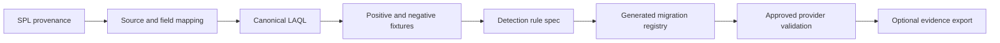

# Splunk Rule Migration to OCI Log Analytics

## Purpose and supported mode

This guide migrates a Splunk analytic into the repository's canonical OCI Log Analytics query and detection interfaces. It supports Mode 2 evidence export and records whether the same source also uses Mode 1 raw delivery. Migration is semantic translation and validation, not blind SPL-to-LAQL rewriting.

Production raw delivery must use a pinned, reviewed `oci-splunk` ref and must not track mutable `main`. Current provenance is tag `2.2.0` at commit `a98167404f19be6d18235bccbf1113b59a259c4c`; source links for its four migrated alerts are pinned in [`config/splunk_parallel_delivery.yaml`](../config/splunk_parallel_delivery.yaml).

## Prerequisites and ownership

Assign a Splunk content owner, Log Analytics query owner, source/parser owner, detection/Monitoring owner, privacy/retention owner, cost owner, and validation approver. Record the licensed source of the SPL, version/ref, security objective, false positives, required events, current schedule/window, index/sourcetype assumptions, target OCI source/display fields, and whether original SPL may be redistributed.

Required repository inputs are real fields in [`queries/log_source_field_dictionary.json`](../queries/log_source_field_dictionary.json), canonical query placement under `queries/hunting/` or portable source rules under `rules/`, deterministic positive/negative fixtures, and a delivery entry in `config/splunk_parallel_delivery.yaml`. Never create `queries/splunk/`, hand-edit `queries/splunk_detection_registry.json`, or introduce placeholder fields.

## Architecture and workflow

See the editable [migration architecture](diagrams/logan-splunk-architecture.mmd) and [onboarding sequence](diagrams/logan-splunk-onboarding.mmd).



Collection, parsing, Log Analytics query behavior, detection-rule eligibility, Monitoring metric, alarm, Notifications, Function, checkpoint/DLQ, HEC confirmation, Splunk searchability, and provider acceptance remain separate gates.

## Current migration inventory

The generated registry contains nine detections: four pinned `oci-splunk` alerts (VCN rejected-traffic spike, OCI Audit failures, IAM/policy changes, and Object Storage access from a new external source) and five versioned Splunk Security Content Windows access analytics (failed-logon burst, after-hours RDP, Administrator logon, new local user, and privileged-group addition). [`queries/splunk_detection_registry.json`](../queries/splunk_detection_registry.json) is the generated navigation contract; canonical LAQL stays in the referenced query files.

## IAM and network requirements

Local migration needs no OCI credentials or network. Provider validation needs the operator's reviewed Log Analytics permissions for the target compartment/log group, scheduled-task and detection-rule permissions, Monitoring metric/alarm read or manage permissions, and only the additional Mode 1 or Mode 2 policies for the approved delivery path. Preview policy categories offline:

```bash
/Users/abirzu/oci-cli/bin/python3 scripts/splunk_evidence_exporter_cli.py render-iam
```

Never copy broad example policy unchanged. Resolve every placeholder and verify the target, region, conditional keys, and dynamic-group match. For evidence export, the Function network must resolve and validate the HTTPS HEC hostname through a reviewed private route or NAT/egress; migration validation alone makes no external call.

## Manual migration steps

1. In Splunk Web **Search & Reporting**, open the saved search and record its app/version, SPL, time picker, macros/lookups/data models, thresholds, aggregation, suppression, and expected positive and negative results. Do not paste licensed content into a public artifact without permission.
2. Map every source and field to a real Log Analytics display field. If the source/parser is absent, stop and onboard it before translation.
3. Classify fidelity as `lossless`, `transformed`, `evidence`, or `unsupported`. Mark unsupported semantics rather than claiming equivalence.
4. Author the canonical query in the approved repository seam. Preserve time-window, aggregation, and threshold semantics explicitly.
5. In OCI Console **Log Analytics → Log Explorer**, paste the LAQL, select the exact compartment/log group and representative window, and run it against approved data. Validate positive and negative controls and inspect parsed fields.
6. Save the query. If [`queries/detection_rule_specs.json`](../queries/detection_rule_specs.json) marks it eligible, create the scheduled detection rule under **Log Analytics → Administration → Detection Rules**. Use the generated schedule, lookback, numeric metric alias, and at most three dimensions; keep downstream alarms disabled.
7. Verify the first metric in the detection rule's **Metrics** tab or Monitoring Metrics Explorer. Only then create a disabled alarm and proceed to Mode 2 canary review.
8. In Splunk **Search & Reporting**, validate the raw Mode 1 event or normalized Mode 2 evidence by the approved index/sourcetype, time window, and stable `event_key` as applicable.

Expected output is a versioned migration record pointing to one canonical query, proven local match/nonmatch behavior, an accurate eligibility result, and separate evidence states. A query that runs locally or in one OCI data window is not automatically equivalent to the original analytic.

## Script-assisted steps

Run one change at a time from the repository root:

```bash
/Users/abirzu/oci-cli/bin/python3 scripts/generate_splunk_detection_registry.py --check
/Users/abirzu/oci-cli/bin/python3 scripts/detection_rule_creator.py --eligible-only
/Users/abirzu/oci-cli/bin/python3 -m pytest scripts/test_splunk_detection_registry.py -q
/Users/abirzu/oci-cli/bin/python3 scripts/splunk_evidence_exporter_cli.py validate-config
```

When intentionally updating the generated registry after changing canonical configuration:

```bash
/Users/abirzu/oci-cli/bin/python3 scripts/generate_splunk_detection_registry.py
```

Then review the exact diff and rerun `--check`. Do not hand-edit the generated output. `scripts/ql/splunk.py` is a conversion module used by existing code/tests, not a supported operator CLI.

## Validation gates and expected output

1. **Source:** a fresh record exists in Log Analytics.
2. **Parsing:** all required display fields carry expected types/values.
3. **Query:** positive fixture/data hits and negative control does not.
4. **Detection rule:** generated spec is eligible and scheduled constraints pass.
5. **Monitoring metric:** actual namespace, metric name, value, and bounded dimensions appear.
6. **Alarm:** reviewed alarm transitions only for the canary.
7. **Notifications and Function:** exact subscription invokes the expected Function.
8. **Checkpoint/DLQ:** delivery confirms before checkpoint; failure preserves replay state.
9. **HEC confirmation:** configured `response` or `indexer_ack` condition succeeds.
10. **Splunk searchability:** event is queryable in the intended index/sourcetype.
11. **Provider acceptance:** all authenticated receipts and owner sign-off are present.

## Failure modes

| Failure | Resolution |
|---|---|
| SPL depends on an unavailable lookup/macro/data model | Model the dependency explicitly or mark unsupported |
| Field is absent or ambiguous | Correct the parser/dictionary; never add a placeholder |
| Aggregation differs | Compare both systems on the same bounded dataset and window |
| Query is not scheduled-rule eligible | Keep it interactive or redesign without weakening semantics |
| Metric has excessive dimensions | Reduce to no more than three stable, bounded dimensions |
| Registry `--check` fails | Regenerate from config, inspect diff, and test; do not patch JSON |
| HEC/Splunk result differs | Stop promotion and compare envelope fields/time/index/sourcetype |

## Cost, retention, privacy, and cardinality

Migration can increase scheduled query work, Monitoring custom metric volume, alarm/Notifications/Function invocations, evidence retention, network egress, and Splunk indexed volume. Test realistic cardinality and event rates before choosing schedule/window and dimensions. Mode 1 duplicates raw storage/license volume; Mode 2 still exports user/host/address context unless field minimization removes it.

Record Log Analytics and Splunk retention independently. Default evidence excludes original content. Review sensitive fields, purpose, access, residency, and deletion obligations before provider testing. Never commit raw production rows, OCIDs, credentials, addresses, hostnames, or customer topology.

## Rollback, cleanup, and replay

Rollback a migration by disabling its alarm/export action, then disabling the detection rule if required; keep collection and the previous accepted query available. Revert canonical content only through normal source/config generation, not by editing generated registry JSON. Remove test saved searches/alarms only after receipts are retained and owners confirm no shared dependency.

Migration does not itself replay data. Failed Mode 2 evidence stays in the DLQ with stable event keys; use the [export runbook](SPLUNK_EVIDENCE_EXPORT_RUNBOOK.md) and its offline replay plan. Mode 1 replay/offset recovery belongs to the pinned `oci-splunk` consumer procedure.

## Evidence class and limitations

Repository generation/tests are **code-backed** and **locally verified**. A saved OCI query/rule is **configured**. Live data hits, metric, alarm, Function, and HEC receipts are individually **provider verified** only when captured from the authorized target. Splunk search plus owner sign-off is needed for **release accepted**. The current migration registry does not prove any tenant deployment or semantic equivalence beyond its recorded evidence.

## Oracle sources

- [Manage Log Analytics detection rules](https://docs.oracle.com/en-us/iaas/log-analytics/doc/manage-detection-rules.html)
- [Create a scheduled saved-search task](https://docs.oracle.com/iaas/log-analytics/doc/create-schedule-run-saved-search.html)
- [Log Analytics query IAM policy reference](https://docs.oracle.com/en-us/iaas/Content/Identity/policyreference/loganalyticspolicyreference.htm)
- [Manage alarms in Log Analytics](https://docs.oracle.com/en-us/iaas/log-analytics/doc/manage-alarms-logging-analytics.html)
- [Splunk Search app](https://help.splunk.com/en/splunk-enterprise/search/search-manual/10.4/use-the-search-app/about-the-search-app)
