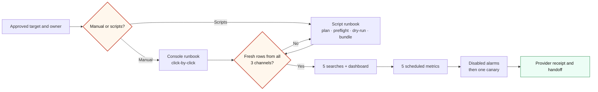

# Windows Access Monitoring Fast Onboarding

Use this track when a customer needs a short, repeatable path from a Windows
Server to searchable access events, five operational alerts, and an OCI Log
Analytics dashboard. It specializes the repository's
[general fast onboarding track](FAST_ONBOARDING_TRACK.md) and reuses its IAM,
data-movement, validation, troubleshooting, cost, and handoff guidance.

> **Evidence boundary:** this pack is **code-backed** and its deterministic
> fixtures are **locally verified**. The customer path is **provider verified**
> only when a newly generated Windows event travels through the approved
> Management Agent, is parsed under the expected Oracle-defined source, is
> returned by Log Explorer, and is visible in the dashboard or scheduled-search
> result. Repository testing changed no live Windows host or OCI tenancy.

## Outcome

- Collect the Windows **Security**, **System**, and **Application** channels.
- Reuse Oracle-defined `Windows Security Events`, `Windows System Events`, and
  `Windows Application Events` sources and built-in fields.
- Cover Events `4624`, `4625`, `4634`, `4648`, `4672`, `4720`, `4726`, `4732`,
  `4733`, and `4776`.
- Deploy five alert-ready searches and `SOC: Windows Access Monitoring`.
- Run deterministic local validation before any tenant mutation.

## Choose the operating path

Both paths produce the same resources and must pass the same proof gates:

| Path | Start here | Best for |
|---|---|---|
| Manual OCI Console | [Manual console runbook](WINDOWS_ACCESS_MANUAL_RUNBOOK.md) | First deployment, change-controlled customer work, or operators learning each OCI resource |
| Script-assisted | [Script-assisted runbook](WINDOWS_ACCESS_SCRIPTED_RUNBOOK.md) | Repeatable lab/customer rollout with offline plans, guarded Windows actions, dry-runs, and one JSON file per OCI mutation |

Use the [workflow diagram set](WINDOWS_ACCESS_WORKFLOW_DIAGRAMS.md) for the
architecture, manual-versus-script lanes, saved-search-to-notification sequence,
troubleshooting decision tree, and evidence progression. Editable source is in
[`docs/diagrams`](diagrams/).

If Splunk is required, preserve this Management Agent → Log Analytics path as the collection/source-of-truth path. The five Windows access analytics are registered for optional Mode 2 evidence export; after their query and Monitoring metric proof, a reviewed alarm/Notifications/Function path can send bounded evidence to Splunk HEC. Raw Windows delivery is a separate customer-owned decision and is not implied by `oci-splunk`'s OCI Logging fan-out. See [Splunk Parallel Operations](SPLUNK_PARALLEL_OPERATIONS.md), [Rule Migration](SPLUNK_RULE_MIGRATION.md), and the editable [on-prem parallel diagram](diagrams/logan-splunk-onprem-agent.mmd).



## Workflow

```mermaid
flowchart LR
    TARGET["Confirm exact OCI target<br/>and Windows host"]
    IAM["Review user, service and<br/>Management Agent policies"]
    HOST{"mgmt_agent<br/>installed?"}
    INSTALL["Run Oracle installer.bat<br/>with Log Analytics plugin"]
    ENABLE["Start and verify<br/>mgmt_agent"]
    ENTITY["Create/reuse<br/>Host (Windows) entity"]
    SOURCES["Associate native sources<br/>Security · System · Application"]
    FLOW["Management Agent<br/>continuous collection"]
    LA["Parse and store in<br/>target log group"]
    PROVE{"New event and fields<br/>queryable?"}
    FIX["Audit policy → service → plugin<br/>association → network → errors"]
    CONTENT["Deploy 5 searches<br/>and dashboard"]
    ALERTS["5-minute scheduled searches<br/>then alarms/notifications"]

    TARGET --> IAM --> HOST
    HOST -->|No| INSTALL --> ENABLE
    HOST -->|Yes| ENABLE
    ENABLE --> ENTITY --> SOURCES --> FLOW --> LA --> PROVE
    PROVE -->|No| FIX --> PROVE
    PROVE -->|Yes| CONTENT --> ALERTS

    classDef gate fill:#fff7ed,stroke:#c74634,stroke-width:2px,color:#161513;
    classDef control fill:#f3f4f6,stroke:#6b7280,stroke-dasharray:5 3,color:#161513;
    classDef transport fill:#eff6ff,stroke:#2563eb,color:#161513;
    classDef success fill:#ecfdf5,stroke:#15803d,stroke-width:2px,color:#161513;
    classDef failure fill:#fef2f2,stroke:#b91c1c,color:#161513;
    class HOST,PROVE gate;
    class TARGET,IAM control;
    class INSTALL,ENABLE,ENTITY,SOURCES,FLOW,LA transport;
    class CONTENT,ALERTS success;
    class FIX failure;
```



Do not deploy content or widen collection until a new event passes the proof
gate.

## 1. Record the target and stop conditions

Record these in the customer's change record, never in this repository:

| Required value | Why |
|---|---|
| OCI profile, identity domain, and region | Prevent a cross-tenancy or cross-region write |
| Resource/dashboard compartments and log group | Bound access, entities, agents, and dashboards |
| Windows hostname or OCI instance OCID | Identify the one authorized host |
| Management Agent and Windows entity OCIDs | Bind agent, entity, and sources |
| Business hours and query timezone | Make the RDP rule meaningful |
| Operator, response owner, and stop condition | Ensure alerts have ownership |

Stop if any resolved target differs from approval, if a custom parser would
replace an Oracle-defined source, or if initial volume is materially unexpected.

## 2. Apply the minimum policies

Prefer Oracle's current **Log Analytics admin** policy template. Replace every
placeholder with approved values. The features-family grant is tenancy-level;
resource and dashboard grants can be compartment-scoped.

```text
allow service loganalytics to read loganalytics-features-family in tenancy

allow group <IDENTITY_DOMAIN>/<LA_ADMIN_GROUP> to use loganalytics-features-family in tenancy
allow group <IDENTITY_DOMAIN>/<LA_ADMIN_GROUP> to use loganalytics-resources-family in compartment <LA_COMPARTMENT>
allow group <IDENTITY_DOMAIN>/<LA_ADMIN_GROUP> to manage management-dashboard-family in compartment <DASHBOARD_COMPARTMENT>
allow group <IDENTITY_DOMAIN>/<LA_ADMIN_GROUP> to read compartments in tenancy

allow group <IDENTITY_DOMAIN>/<LA_ADMIN_GROUP> to manage management-agents in compartment <AGENT_COMPARTMENT>
allow group <IDENTITY_DOMAIN>/<LA_ADMIN_GROUP> to manage management-agent-install-keys in tenancy
allow group <IDENTITY_DOMAIN>/<LA_ADMIN_GROUP> to read metrics in compartment <AGENT_COMPARTMENT>
allow group <IDENTITY_DOMAIN>/<LA_ADMIN_GROUP> to read users in tenancy
```

Create a compartment-scoped Management Agent dynamic group:

```text
ALL {resource.type='managementagent', resource.compartment.id='<AGENT_COMPARTMENT_OCID>'}
```

Authorize upload and metrics:

```text
allow dynamic-group <IDENTITY_DOMAIN>/<MANAGEMENT_AGENT_DYNAMIC_GROUP> to use metrics in tenancy
allow dynamic-group <IDENTITY_DOMAIN>/<MANAGEMENT_AGENT_DYNAMIC_GROUP> to {LOG_ANALYTICS_LOG_GROUP_UPLOAD_LOGS} in tenancy
```

Scheduled searches run as Log Analytics scheduled-task resources. Create a
separate, compartment-bound dynamic group:

```text
ALL {resource.type='loganalyticsscheduledtask', resource.compartment.id='<LA_COMPARTMENT_OCID>'}
```

Use Oracle's **Allow detection rule dynamic groups to run** policy template.
Oracle's scheduled-task procedure currently lists these statements:

```text
allow group <IDENTITY_DOMAIN>/<LA_ADMIN_GROUP> to use loganalytics-scheduled-task in tenancy
allow group <IDENTITY_DOMAIN>/<LA_ADMIN_GROUP> to {MANAGEMENT_SAVED_SEARCH_READ} in tenancy

allow dynamic-group <IDENTITY_DOMAIN>/<DETECTION_RULE_DYNAMIC_GROUP> to use metrics in tenancy
allow dynamic-group <IDENTITY_DOMAIN>/<DETECTION_RULE_DYNAMIC_GROUP> to read management-saved-search in tenancy
allow dynamic-group <IDENTITY_DOMAIN>/<DETECTION_RULE_DYNAMIC_GROUP> to {LOG_ANALYTICS_QUERY_VIEW} in tenancy
allow dynamic-group <IDENTITY_DOMAIN>/<DETECTION_RULE_DYNAMIC_GROUP> to {LOG_ANALYTICS_QUERYJOB_WORK_REQUEST_READ} in tenancy
allow dynamic-group <IDENTITY_DOMAIN>/<DETECTION_RULE_DYNAMIC_GROUP> to read loganalytics-log-group in tenancy
allow dynamic-group <IDENTITY_DOMAIN>/<DETECTION_RULE_DYNAMIC_GROUP> to {LOG_ANALYTICS_LOOKUP_READ} in tenancy
allow dynamic-group <IDENTITY_DOMAIN>/<DETECTION_RULE_DYNAMIC_GROUP> to read compartments in tenancy
allow service loganalytics to use metrics in compartment <METRIC_COMPARTMENT>
```

Review whether the target tenancy's policy design and current OCI policy
reference allow narrower resource statements before applying these tenancy
examples. Alarm creation also needs permission to manage alarms in the alarm
compartment and to use the approved Notifications topic; keep notification
administration with its existing owner.
See Oracle's [scheduled-search task procedure](https://docs.oracle.com/iaas/log-analytics/doc/create-schedule-run-saved-search.html)
and [alarm creation procedure](https://docs.oracle.com/en-us/iaas/Content/Monitoring/Tasks/create-alarm-basic.htm).

Authority: Oracle's [prerequisite policies](https://docs.oracle.com/en-us/iaas/log-analytics/doc/prerequisite-iam-policies.html),
[continuous collection policies](https://docs.oracle.com/en-us/iaas/log-analytics/doc/allow-continuous-log-collection-using-management-agents.html),
and [policy templates](https://docs.oracle.com/en-us/iaas/log-analytics/doc/oracle-defined-policy-templates-common-use-cases.html).
Review the final statements in the target tenancy.

## 3. Prepare Windows auditing and the agent

Use the guarded
[`management_agent_access_setup.ps1`](../scripts/windows/management_agent_access_setup.ps1)
helper. Print its portable plan anywhere:

```bash
pwsh -NoProfile -File scripts/windows/management_agent_access_setup.ps1 -Mode Plan
```

On the authorized Windows Server, use elevated PowerShell for the read-only
preflight:

```powershell
pwsh -NoProfile -File .\scripts\windows\management_agent_access_setup.ps1 -Mode Preflight
auditpol.exe /get /category:*
```

Supply `-Region '<REGION>'` to also test the two required regional HTTPS 443
endpoints. The current preflight reports Administrator context, WMIC, JDK/JRE 8
update 281 or newer, 300 MB free disk, Windows time-service status, the three
channels, agent state, and endpoint reachability.

The helper checks Administrator context, WMIC availability, the three event
channels, and `mgmt_agent`. Review effective auditing for Logon, Special Logon,
Other Logon/Logoff Events, Credential Validation, User Account Management, and
Security Group Management. Change an approved GPO rather than a local setting
when Group Policy owns audit configuration.

### Existing agent

```powershell
sc.exe query mgmt_agent
Get-Content 'C:\Oracle\mgmt_agent\agent_inst\log\mgmt_agent.log' -Tail 100
```

After review, explicitly start an installed agent:

```powershell
pwsh -NoProfile -File .\scripts\windows\management_agent_access_setup.ps1 `
  -Mode Enable -ConfirmInstall
```

### New standalone agent

Download the Windows x86_64 package and install-key response template from the
approved region. Treat the response file as a secret and include:

```text
Service.plugin.logan.download=true
```

Extract the Oracle package, then invoke its documented `installer.bat` through
the guarded wrapper:

```powershell
pwsh -NoProfile -File .\scripts\windows\management_agent_access_setup.ps1 `
  -Mode Install `
  -InstallerDirectory 'C:\approved\oracle-management-agent' `
  -ResponseFile 'C:\secure\input.rsp' `
  -ConfirmInstall
```

Move or delete the response file after registration. See Oracle's
[Windows Server installation procedure](https://docs.oracle.com/en-us/iaas/management-agents/doc/install-management-agent-chapter.html),
[Windows prerequisites](https://docs.oracle.com/en-us/iaas/management-agents/doc/perform-prerequisites-deploying-management-agents.html),
and [Log Analytics plugin requirement](https://docs.oracle.com/en-us/iaas/log-analytics/doc/install-management-agents.html).
For Windows Server, use this standalone-agent path. Oracle currently documents
the Oracle Cloud Agent Management Agent plug-in path for supported Linux compute
images, not Windows compute instances. Never install a second agent over an
existing one.

## 4. Associate the Oracle-defined Windows sources

Do not create duplicates for continuous collection:

| Channel | Display name | Internal name |
|---|---|---|
| Security | `Windows Security Events` | `MsftWinEventSecurityLogSource` |
| System | `Windows System Events` | `MsftWinEventSystemLogSource` |
| Application | `Windows Application Events` | `MsftWinEventApplicationLogSource` |

These Microsoft Windows Event System sources need no custom parser. See
[Windows Event Monitoring](https://docs.oracle.com/en-us/iaas/log-analytics/doc/windows-event-monitoring.html)
and the [Oracle-defined source catalog](https://docs.oracle.com/en-us/iaas/log-analytics/doc/oracle-defined-sources.html).

Read-only inventory:

```bash
oci log-analytics source list-sources \
  --profile '<PROFILE>' --region '<REGION>' \
  --namespace-name '<LA_NAMESPACE>' \
  --compartment-id '<LA_COMPARTMENT_OCID>' \
  --is-system ALL --all
```

In **Log Analytics → Administration → Entities**, create or reuse the exact
`Host (Windows)` entity mapped to the agent. Under **Source Associations**,
associate all three sources with that entity and the intended log group.
Association starts collection. See [Manage Source-Entity Association](https://docs.oracle.com/iaas/log-analytics/doc/manage-source-entity-association.html).
An `ACTIVE` agent alone is not collection proof.

Render the exact association body with placeholders or reviewed OCIDs. This
command is offline and does not call OCI:

```bash
python3 scripts/windows_access_onboarding.py association-template \
  --agent-id '<MANAGEMENT_AGENT_OCID>' \
  --entity-id '<WINDOWS_ENTITY_OCID>' \
  --log-group-id '<LOG_GROUP_OCID>'
```

Review the three `items`, then pass only the `items` array to
`oci log-analytics assoc upsert-assocs --items file://...` after explicit
approval. Do not pass the whole report object. Re-list the entity's source
associations after the write and preserve a sanitized receipt.

## 5. Deploy searches and dashboard

Inspect and validate locally:

```bash
python3 scripts/windows_access_onboarding.py plan --json
python3 scripts/windows_access_onboarding.py validate-local --json
```

Dry-run the tenant content:

```bash
python3 scripts/setup_log_sources.py --windows-access-only --dry-run
python3 scripts/deploy_dashboard.py \
  --dashboard-name 'SOC: Windows Access Monitoring' --dry-run
```

The first script's two custom Security/System JSON sources exist only for
deterministic **synthetic upload testing**. Application-channel fixtures are
validated locally; optional upload reuses an already configured
`SOC Application Logs` source. None replace native continuous sources.
After target review and explicit approval:

```bash
python3 scripts/setup_log_sources.py --windows-access-only
python3 scripts/deploy_dashboard.py \
  --dashboard-name 'SOC: Windows Access Monitoring'
```

Live query validation is on by default. Do not use `--skip-live-validation` for
customer acceptance.

| Search | Logic | Window / trigger |
|---|---|---|
| [Failed logon burst](../queries/hunting/windows_access_failed_logon_burst.json) | 4625 by source, target, host | 5m; `FailedLogons > 10` |
| [RDP after hours](../queries/hunting/windows_access_rdp_after_hours.json) | 4624, logon type 10, outside 08:00–18:00 | 5m; `RDPLogons > 0` |
| [Administrator logon](../queries/hunting/windows_access_administrator_logon.json) | 4624 for Administrator | 5m; `AdministratorLogons > 0` |
| [New local user](../queries/hunting/windows_access_new_local_user.json) | 4720 | 5m; `UsersCreated > 0` |
| [Privileged group add](../queries/hunting/windows_access_privileged_group_add.json) | 4732 for Administrators/RDP Users | 5m; `GroupAdds > 0` |

Scheduled searches emit metrics. OCI Monitoring alarms and Notifications are
separate resources; saving a search does not send an alert. Tune timezone,
localized/renamed Administrator accounts, service accounts, approved automation,
and notification ownership before paging.

Render all five scheduled-task and alarm payloads offline:

```bash
python3 scripts/windows_access_onboarding.py alert-plan \
  --log-analytics-compartment-id '<LA_COMPARTMENT_OCID>' \
  --metric-compartment-id '<METRIC_COMPARTMENT_OCID>' \
  --alarm-compartment-id '<ALARM_COMPARTMENT_OCID>' \
  --notification-topic-id '<NOTIFICATION_TOPIC_OCID>'
```

The output deliberately contains a saved-search OCID placeholder for each
query. Create and live-validate those saved searches first, replace the five
placeholders, and then use each `action` and `schedules` object with
`oci log-analytics scheduled-task create-standard-task`. The namespace
`logan_windows_access` is intentionally not prefixed with reserved `oci_` or
`oracle_`. The alarms use `<MetricName>[5m].sum() > 0` because the searches
already perform the event thresholding, and every generated alarm is disabled.
Enable one canary only after its numeric metric and dimensions are visible in
Metric Explorer and the notification owner approves the route.

For a file-per-mutation bundle that can be reviewed and then passed to OCI CLI,
use:

```bash
python3 scripts/windows_access_onboarding.py render-cli-bundle \
  --output-dir '<RESTRICTED_TEMP_DIRECTORY>' \
  --namespace-name '<LA_NAMESPACE>' \
  --log-analytics-compartment-id '<LA_COMPARTMENT_OCID>' \
  --metric-compartment-id '<METRIC_COMPARTMENT_OCID>' \
  --alarm-compartment-id '<ALARM_COMPARTMENT_OCID>' \
  --notification-topic-id '<NOTIFICATION_TOPIC_OCID>' \
  --agent-id '<MANAGEMENT_AGENT_OCID>' \
  --entity-id '<WINDOWS_ENTITY_OCID>' \
  --log-group-id '<LOG_GROUP_OCID>'
```

The bundle contains one association file, five scheduled-task files, five
disabled-alarm files, and a manifest. It is offline, refuses accidental
overwrite, and retains saved-search OCID placeholders as explicit blocking
gates. Because rendered OCIDs are sensitive tenant identifiers, never commit the
bundle.

## 6. E2E proof

### Repeatable local proof

```bash
python3 scripts/windows_eventlog_synthetic.py generate
python3 scripts/windows_eventlog_synthetic.py validate
python3 scripts/windows_access_onboarding.py validate-local --json
python3 -m pytest \
  scripts/test_windows_access_onboarding.py \
  scripts/test_windows_eventlog_synthetic.py \
  scripts/test_setup_log_sources.py \
  scripts/test_deploy_dashboard.py -q
```

Optional approved synthetic upload:

```bash
python3 scripts/windows_eventlog_synthetic.py ingest --dry-run
python3 scripts/windows_eventlog_synthetic.py ingest
```

This proves the JSON parser/search/dashboard path, not native agent collection.

### Provider proof

Generate one approved event at a time in a lab or canary account. Never create
an unauthorized production account or group membership solely to test an
alert. Start broad in Log Explorer:

```text
'Log Source' in ('Windows Security Events', 'Windows System Events', 'Windows Application Events')
| stats count as Events by 'Log Source'
| sort -Events
```

```text
'Log Source' = 'Windows Security Events'
and 'Event ID' in ('4624', '4625', '4634', '4648', '4672', '4720', '4726', '4732', '4733', '4776')
| stats count as Events by 'Event ID', 'Host Name (Server)'
| sort -Events
```

Confirm `Time`, `Event ID`, `Logon Type`, `Source Address`, `Subject User Name`,
`Target User Name`, `Host Name (Server)`, `User`, and message content. Keep the
time range in Explorer or the scheduled task, not the OCL string. Review agent
warnings and `logCollectionUploadDataSize` / `logCollectionUploadFailureCount`;
see [Monitor Continuous Collection](https://docs.oracle.com/en-us/iaas/log-analytics/doc/monitor-your-continuous-log-collection.html).

Provider acceptance:

- [ ] Agent is running in the exact region/compartment and the Log Analytics plugin is deployed.
- [ ] The Windows entity is mapped to the correct agent.
- [ ] All three native sources target the correct entity/log group.
- [ ] A new Security, System, and Application record is queryable.
- [ ] The ten Security IDs have confirmed audit coverage; unsafe-to-generate IDs remain recorded as unverified.
- [ ] All five searches return the intended canary or approved historical rows.
- [ ] Dashboard renders and scheduled-search metrics are emitted.
- [ ] Monitoring alarm state and notification delivery are tested separately.
- [ ] If Mode 2 is approved, Function query, HEC confirmation, checkpoint/DLQ, and Splunk searchability are tested separately.

## Troubleshooting and rollback

Check: Windows audit policy and Event Viewer → `mgmt_agent` and its log → Log
Analytics plugin/network/proxy/TLS → entity/source associations → target region,
log group, compartment and permissions → collection warnings/upload failures/
`ProcessingErrors` → query source, time, type and fields → metric/alarm/notification.
An empty query is inconclusive until every layer is checked.

Rollback is bounded: disable/remove this entity's three source associations;
disable this pack's scheduled searches or alarms; and remove only this pack's
dashboard/searches if required. Do not uninstall a shared agent, delete a log
group, or purge logs. Purge is destructive and outside this track.

## Repository assets

| Asset | Purpose |
|---|---|
| [`windows_access_onboarding.py`](../scripts/windows_access_onboarding.py) | Plan and local five-alert evaluator |
| [`management_agent_access_setup.ps1`](../scripts/windows/management_agent_access_setup.ps1) | Windows plan, preflight, guarded install/enable |
| [`setup_log_sources.py`](../scripts/setup_log_sources.py) | Narrow Security/System synthetic fields/parsers/sources |
| [`windows_eventlog_synthetic.py`](../scripts/windows_eventlog_synthetic.py) | Security/System/Application fixtures and upload |
| [`deploy_dashboard.py`](../scripts/deploy_dashboard.py) | Saved-search/dashboard deployment |
| [`test_windows_access_onboarding.py`](../scripts/test_windows_access_onboarding.py) | Public onboarding contracts |
| [Manual console runbook](WINDOWS_ACCESS_MANUAL_RUNBOOK.md) | Click-by-click Windows and OCI procedure |
| [Script-assisted runbook](WINDOWS_ACCESS_SCRIPTED_RUNBOOK.md) | Guarded commands, OCI CLI bundle, apply order, and verification |
| [Workflow diagrams](WINDOWS_ACCESS_WORKFLOW_DIAGRAMS.md) | Architecture, path lanes, sequence, troubleshooting, evidence ladder |
| [`windows-access-architecture.json`](diagrams/windows-access-architecture.json) | Editable diagram specification |
| [`windows-access-architecture.mmd`](diagrams/windows-access-architecture.mmd) | Validated Mermaid source |
