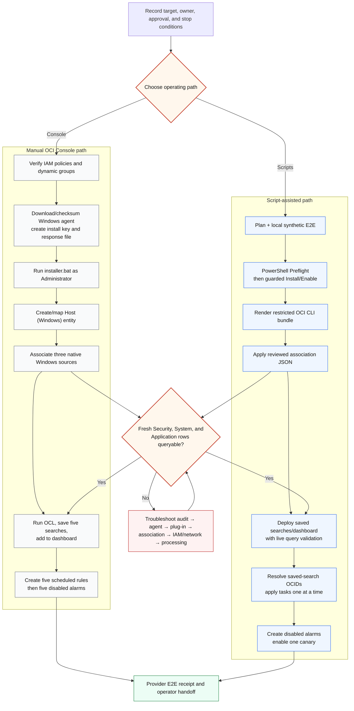
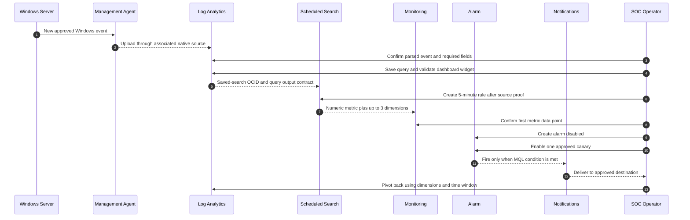
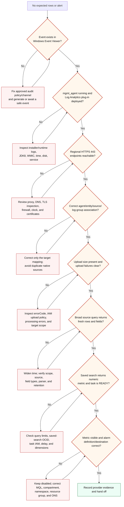
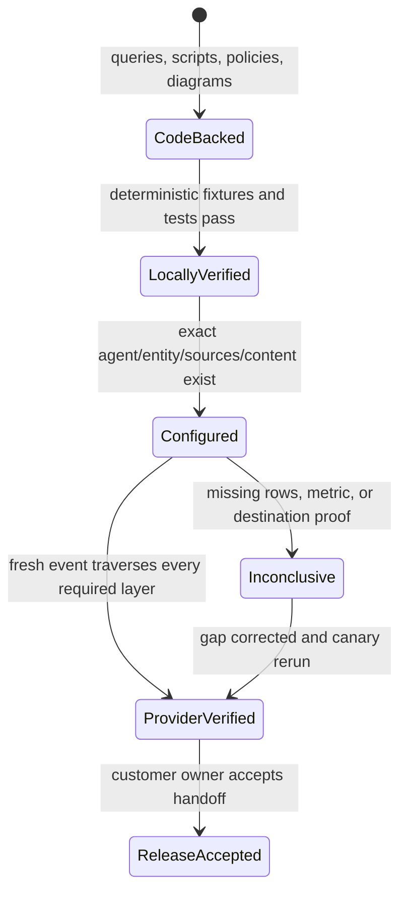

# Windows Access Monitoring Workflow Diagrams

These editable Mermaid diagrams accompany the
[Windows access fast onboarding overview](WINDOWS_ACCESS_FAST_ONBOARDING.md).
They are tenant-neutral design artifacts; they contain no customer topology or
provider acceptance claim.

The logical architecture also has an offline-generated
[JSON diagram specification](diagrams/windows-access-architecture.json) and
[Mermaid source](diagrams/windows-access-architecture.mmd). The Mermaid source
passed the OCI diagramming skill's structural and active-content validation.

For a Windows source that also delivers detection evidence to Splunk, continue with the full editable [on-prem Management Agent path](diagrams/logan-splunk-onprem-agent.mmd), [evidence-export sequence](diagrams/logan-splunk-export-sequence.mmd), [validation layers](diagrams/logan-splunk-validation.mmd), and [replay state](diagrams/logan-splunk-replay-state.mmd). The [Splunk operations guide](SPLUNK_PARALLEL_OPERATIONS.md) owns raw-versus-evidence decisions; this page keeps the Windows collection and detection workflow focused.

## 1. Collection, detection, and response architecture

```mermaid
flowchart LR
  subgraph WIN["Authorized Windows Server"]
    EVENTS["Windows Event Log<br/>Security · System · Application"]
    AGENT["Oracle Management Agent<br/>Log Analytics plug-in"]
    EVENTS -. telemetry .-> AGENT
  end

  subgraph OCI["OCI operational plane"]
    ASSOC["Host (Windows) entity<br/>3 native source associations"]
    LOGAN["OCI Log Analytics<br/>parse · fields · log group"]
    CONTENT["5 saved searches<br/>Windows access dashboard"]
    TASKS["5-minute scheduled searches<br/>numeric metric · ≤3 dimensions"]
    MON["OCI Monitoring<br/>logan_windows_access"]
    ALARMS["Disabled alarm canaries<br/>reviewed enablement"]
    ONS["OCI Notifications<br/>approved SOC destination"]
  end

  AGENT -. "HTTPS 443" .-> ASSOC
  ASSOC -. control .-> LOGAN
  LOGAN --> CONTENT
  LOGAN --> TASKS
  TASKS -. metric .-> MON
  MON -. evaluation .-> ALARMS
  ALARMS -. response .-> ONS
  CONTENT -. "analyst validates first" .-> ALARMS

  classDef source fill:#f3f4f6,stroke:#4b5563,color:#161513;
  classDef telemetry fill:#eff6ff,stroke:#2563eb,color:#161513;
  classDef analysis fill:#fff7ed,stroke:#c74634,color:#161513;
  classDef response fill:#ecfdf5,stroke:#15803d,color:#161513;
  class EVENTS source;
  class AGENT,ASSOC,LOGAN telemetry;
  class CONTENT,TASKS,MON analysis;
  class ALARMS,ONS response;
```

Line semantics: solid arrows are query/data use; short-dashed arrows are
telemetry; control/evaluation and response paths remain explicitly labeled.
Source association, dashboard import, scheduled-task creation, alarm creation,
and alarm enablement are separate mutations.

## 2. Manual and script-assisted paths

Both paths converge on the same collection proof gate. Scripts reduce typing;
they do not lower IAM, target confirmation, evidence, or approval requirements.

## 3. Saved search to notification sequence

The sequence prevents a common failure: enabling a notification before proving
the saved search produces a numeric metric in Monitoring.

## 4. Troubleshooting decision workflow

An empty query never skips directly to “no activity.” Each layer must either be
verified or recorded as unavailable/inconclusive.

## 5. Evidence progression

Do not infer a higher state from a lower one. In particular, `ACTIVE` agent,
successful dashboard import, or HTTP success does not prove native Windows event
collection and notification delivery.

When Mode 2 is enabled, extend the ladder after notification: exact Function invocation → bounded Log Analytics query → HEC confirmation → checkpoint commit or DLQ → Splunk searchability. None of those steps is implied by the earlier metric/alarm receipt; validate with [Splunk E2E Validation](SPLUNK_E2E_VALIDATION.md).
